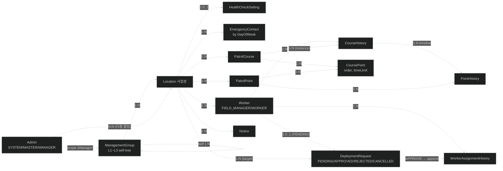

# 모바일순찰 — 데이터 모델 (data-model.md)

> 입력: [`docs/functional-spec.md`](./functional-spec.md), [`docs/screens.md`](./screens.md), [`docs/flow.md`](./flow.md), `docs/ui-mock/**`
> 목적: 백엔드 테이블이 확정되기 전, **화면이 필요로 하는 DTO 형태를 먼저 고정**한다.
> 서버 테이블이 어떤 형태로 가든 이 DTO를 만족하도록 응답을 요구할 수 있도록.
>
> **원칙**
> - 추정 엔티티는 "이 정도 필드를 가질 것이다" 수준의 가벼운 추론(언제든 바뀜).
> - DTO는 화면이 요구하는 응답 모양 그대로. 이 부분이 본 문서의 핵심.
> - 표기: TypeScript `interface`. 명세서·목업에서 명백한 것만 적고, 불명확한 건 주석 또는 Open Questions로.

---

## 0. 명명 규약

- **타입 이름**: PascalCase. 도메인 모델은 명사형(`Worker`, `PatrolCourse`).
- **응답 DTO**: 화면 카드명 + 용도. `WorkerSummary`(목록 행), `WorkerDetail`(상세 패널).
- **요청 DTO**: `Create{Name}Request` / `Update{Name}Request` / `{Action}{Name}Request`.
- **ID**: 모두 `number`(int32), 접미사 `~Seq`. — 실측 확정([`api-spec.md`](./api-spec.md) §1). 기존 `string`(UUID) 가정은 폐기. 코드의 mock도 `number`로 전환 대상.
- **날짜/시간**: ISO 8601 문자열 (`string`, **타임존 없음** — 로컬시각). 화면에서 `Date`로 파싱.
- **분(min) 단위**: `number`. 시각은 `"HH:mm:ss"` 문자열(.NET TimeSpan).
- **서버 우선**: 응답 타입은 **실측 그대로 전량 선언**한다. 화면에서 쓰지 않는 필드도 둔다. 기준은 `api-spec.md`.
  - 본 문서의 DTO는 **화면이 무엇을 필요로 하는지에 대한 설계 의도**를 담는다. 서버 응답과 어긋나면 `api-spec.md`가 이긴다.
  - 우리 설계에만 있는 필드는 **화면에 실제 바인딩되는지 확인** → 필요하면 백엔드 요청, 불필요하면 제거.

---

## 1. 추정 엔티티 (DB 가벼운 추정)

> 정확한 테이블 설계가 아니라 **"이런 엔티티가 있을 것이다"** 수준. 백엔드 확정 시 갱신.



> 화살표는 소유 방향(부모 → 자식). `N:N`은 중간 매핑 테이블 필요. `erDiagram` 대신 `flowchart`로 그린 이유는 일부 Mermaid 익스텐션에서 erDiagram 렌더가 불안정해서다.

**엔티티 한 줄 설명**

| 엔티티 | 의미 |
|---|---|
| `Admin` | 본사·관리 권한 사용자(시스템관리자/Master/Manager) |
| `Worker` | 현장관리자 + 근무자. role로 구분 |
| `ManagementGroup` | Level 3 트리. Level1 = "에스텍시스템" 고정 |
| `Location` | 사업장. 그룹 하위. 헬스체크/비상연락망 설정 보유 |
| `HealthCheckSetting` | 사업장당 1개. 사용시간/예약시간/주기/반복 |
| `EmergencyContact` | 사업장 + 요일 + 담당자 다중 |
| `PatrolPoint` | 인증수단(QR/NFC). 사업장 소속 |
| `PatrolCourse` | 순찰지점들의 순서 있는 묶음. 사업장 소속 |
| `CoursePoint` | 코스-지점 매핑(순서/소요시간/활성) |
| `CourseHistory` | 한 번의 코스 순찰 실행 (시작~종료, 결과) |
| `PointHistory` | 코스 내 각 지점에서 발생한 로그 1건 |
| `WorkerAssignmentHistory` | 근무자 사업장 배치 변경 이력 (승인된 요청의 결과 기록) |
| `DeploymentRequest` | 근무자가 APP에서 발송한 배치·복귀 요청. 상태 = PENDING/APPROVED/REJECTED/CANCELLED. 승인 시 `WorkerAssignmentHistory` 1건 자동 생성 |
| `Notice` | 공지사항 (앱 푸시 트리거 옵션 포함) |
| `Keyword` | 환경설정 키워드 (목업 없음, 형태 TBD) |

---

## 2. 공용 타입 / Enum

### 2-1. API 응답 래퍼 (실측 확정)

> 아래는 **실측으로 교정된 내용**이다. 세부·전체 목록은 [`api-spec.md`](./api-spec.md) §1~§3 참조.

모든 **성공** 응답은 `ApiResponse<T>`로 감싼다. 래퍼 필드명·순서는 당초 설계와 일치했다.

**`code` 필드 규칙 — 🔴 당초 설계 폐기**
- `code`는 **HTTP status code가 아니다.** 비즈니스/권한 코드다.
- 로그인 성공은 **사이트 + 권한 단계**를 함께 나타낸다.

  | `code` | 사이트 | 권한 |
  |---|---|---|
  | `101` / `102` / `103` | 본사 `/admin/*` | 시스템관리자 / Master / Manager |
  | `201` / `202` | 현장 `/*` | 현장관리자 / 근무자 |

- 일반 조회 성공은 `code: 200`.
- `message` 문자열은 엔드포인트마다 미세하게 다르다(마침표 유무 등) → **`message` 로 분기 금지.**
- ✅ **권한 판단의 SSOT는 `code` 가 아니라 JWT `role` 클레임**이다(결정 2026-10-02). `code` 는 로그인 직후 1회성 라우팅 힌트(사이트 분기 + 근무자 차단)로만 쓰고 저장하지 않는다. → `api-spec.md` §2-1
- 🔴 `202`(근무자)는 WEB 접근 불가 대상인데 서버는 토큰을 발급한다. **차단은 프론트 책임**(`spec 020`).
- 🔴 **성공/실패 판정에 `code` 를 쓰지 않는다.** 성공 `code` 가 `200`/`101`/`201` 로 갈리므로 `code === 200` 검사는 로그인을 실패로 만든다. 판정은 HTTP status 2xx 전담 — 구현: `src/lib/axios.ts`(`spec 019`).

**페이지 번호 규칙**
- `pageNumber`는 **1-based**. 첫 페이지 = `1`. URL 쿼리스트링도 동일(`?pageNumber=1`).
- ⚠️ **요청 파라미터는 `pageNumber`, 응답 필드는 `page`** — 이름이 다르다.
- `pageNumber=0` → 400. 범위 초과 → `200` + `items: []`(에러 아님).

```ts
/** 기본 API 응답 래퍼 */
export interface ApiResponse<T> {
  message: string
  data: T
  code: number
}

/**
 * 페이지네이션된 데이터.
 * 🔴 당초 `{ meta, data }` 중첩 설계였으나 실제는 **평면 구조**다.
 */
export interface PagedData<T> {
  items: T[]
  page: number
  pageSize: number
  totalCount: number
  totalPages: number
}

/** 목록 API 응답 타입 */
export type ApiListResponse<T> = ApiResponse<PagedData<T>>

/** 상세 API 응답 타입 — 단일 객체 T */
export type ApiDetailResponse<T> = ApiResponse<T>
```

> 목록 성격인데 `PagedData` 가 아니라 **배열을 직접** 반환하는 엔드포인트가 있다(`GetClassificationPoint`, `GetGroupAdminList`, `GetCourseHistoryCheckDetails` 등). `api-spec.md` §5-1 의 `data 형태` 열로 확인한다.

### 2-2. Enum

> **참고**: 아래 Enum 값들은 백엔드 연결 작업 시 실제 서버 컨벤션에 맞춰 수정될 수 있다.
> (현재는 코드 mock(`PatrolPointResultState` 등) + 명세서 + 목업 기반의 잠정안.)

```ts
// 권한
export type AdminRole = 'SYSTEM' | 'MASTER' | 'MANAGER'
export type FieldRole = 'FIELD_MANAGER' | 'WORKER'
export type Role = AdminRole | FieldRole

// 사용자 상태
export type UserStatus = 'ACTIVE' | 'INACTIVE'

// 근무 상태 (근무자)
export type WorkStatus = 'WORKING' | 'OFF_DUTY'   // 근무시작 / 근무종료

// 사업장 운영 상태
export type LocationStatus = 'OPERATING' | 'SUSPENDED' | 'TERMINATED'  // 운영중/중지/종료

// 배치 요청 상태
export type DeploymentStatus = 'PENDING' | 'APPROVED' | 'REJECTED' | 'CANCELLED'

// 배치 요청 방향 (파견 / 복귀)
export type DeploymentDirection = 'DEPLOY' | 'RETURN'

// 인증 수단
export type AuthMethod = 'QR' | 'NFC'

// 코스 이력 결과
export type CourseResult = 'COMPLETE' | 'PROCESSING' | 'INCOMPLETE'

// 지점 이력 결과 (코드 PatrolPointResultState 기반)
export type PointResult =
  | 'PENDING'    // 대기중
  | 'RUNNING'    // 진행중
  | 'SKIP'       // 순찰제외
  | 'NORMAL'     // 이상없음 (기록 X)
  | 'RECORDED'   // 순찰기록 (기록 O)
  | 'TIMEOUT'    // 시간초과

// 요일 (비상연락망 요일별 담당자)
export type DayOfWeek = 'MON' | 'TUE' | 'WED' | 'THU' | 'FRI' | 'SAT' | 'SUN'
```

---

## 3. 도메인 DTO

각 도메인의 **"기본형(Detail)"**과 **"목록 행(Summary)"**을 함께 정의. 화면 매핑은 §4에서.

### 3-1. 사용자 / 권한

```ts
// 본사 관리자(시스템관리자/Master/Manager) — /admin/admins
export interface Admin {
  id: string
  name: string
  phone: string
  role: AdminRole
  groupId: string          // 소속 관리그룹
  groupPath: string        // 예: "에스텍시스템 > 서울본부"
  status: UserStatus
  registeredAt: string     // ISO
  assignedLocations: LocationRef[]   // 담당 사업장 (다중)
}

export interface AdminSummary {
  id: string
  name: string
  phone: string
  role: AdminRole
  groupName: string
  status: UserStatus
  registeredAt: string
}

// 현장 근무자(현장관리자 포함) — /users
export interface Worker {
  id: string
  name: string
  phone: string
  role: FieldRole
  locationId: string
  locationName: string              // 소속 사업장명
  isAssignedElsewhere: boolean      // 주차관제 같은 타 사업장 배치 여부
  currentAssignedLocation?: LocationRef  // 배치 중이면 현재 소속
  workStatus: WorkStatus
  status: UserStatus
  registeredAt: string
  assignmentHistory: WorkerAssignmentHistoryItem[]
  pendingDeploymentRequest?: DeploymentRequestSummary  // 대기 중이면 1건, 없으면 undefined (근무자 1인 1건 규칙)
}

export interface WorkerSummary {
  id: string
  name: string
  phone: string
  locationName: string
  isAssignedElsewhere: boolean
  workStatus: WorkStatus
  status: UserStatus
  registeredAt: string
}

export interface WorkerAssignmentHistoryItem {
  id: string
  type: 'INITIAL' | 'TRANSFER' | 'RETURN'   // 최초 배치 / 파견 / 원 사업장 복귀
  fromLocationName?: string
  toLocationName: string
  startedAt: string
  endedAt?: string        // null이면 "현재"
}

// 배치 요청 — /deployments 큐 + 이력
// 근무자가 APP에서 특정 사업장으로 배치·복귀를 요청 → **목적지 사업장 관리자**가 승인/거부.
// - 근무자는 대기 중 요청 1건만 보유(재요청 불가). 사용자 취소 가능.
// - 승인 시점에 WorkerAssignmentHistoryItem 1건이 자동 생성된다.
// - 현재 소속 사업장 관리자에게는 별도 통보 없음(근무자 상세의 이력에서 사후 확인).
export interface DeploymentRequest {
  id: string
  direction: DeploymentDirection    // 'DEPLOY' 파견 / 'RETURN' 복귀
  worker: WorkerRef                 // 요청한 근무자
  fromLocation: LocationRef         // 현재 소속(파견 시) 또는 파견지(복귀 시)
  toLocation: LocationRef           // 이동 목적지 = 승인 권한 소유 사업장
  reason: string                    // 근무자가 요청 시 입력한 사유(필수) — 관리자 화면에 노출(014, 목업 근거)
  status: DeploymentStatus
  requestedAt: string               // 요청 시각
  processedAt?: string              // 승인/거부 시각 (취소는 근무자 액션이라 별도 취급 가능)
  processedByName?: string          // 승인/거부 처리 관리자명
  rejectReason?: string             // REJECTED 시 관리자가 입력한 사유(선택)
}

// 큐/이력 목록 행
export interface DeploymentRequestSummary {
  id: string
  direction: DeploymentDirection
  workerName: string
  fromLocationName: string
  toLocationName: string
  reason: string                    // DeploymentRequest.reason과 동일(014)
  status: DeploymentStatus
  requestedAt: string
  processedAt?: string
}

// 참조 (요청 상세 안에서만 사용)
export interface WorkerRef { id: string; name: string; phone: string }
```

### 3-2. 조직 (그룹 / 사업장)

```ts
// 관리그룹 트리 — /admin/locations 좌측 트리
export interface ManagementGroupNode {
  id: string
  name: string
  level: 1 | 2 | 3
  parentId: string | null
  locationCount: number            // 트리 노드 옆 카운트
  children: ManagementGroupNode[]
}

// 사업장 — /admin/locations 우측 테이블 + 상세
export interface Location {
  id: string
  name: string
  groupId: string
  groupPath: string                // 예: "에스텍시스템 > 서울본부 > 강동지사"
  address: string
  contact: string                  // 대표 연락처
  status: LocationStatus
  contractStartDate: string        // YYYY-MM-DD
  contractEndDate: string
  responsibleAdmins: AdminRef[]    // 담당 관리자 다중
}

export interface LocationSummary {
  id: string
  name: string
  groupName: string
  address: string
  contact: string
  status: LocationStatus
}

export interface LocationRef { id: string; name: string; groupName: string }
export interface AdminRef    { id: string; name: string; role: AdminRole; phone: string }
```

### 3-3. 순찰 자원 (지점 / 코스)

```ts
// 순찰지점 — /points
export interface PatrolPoint {
  id: string
  name: string
  description: string
  authenticationMethod: AuthMethod
  nfcTagId?: string                // authenticationMethod === 'NFC' 일 때, 14자리 HEX
  isActive: boolean
  createdAt: string
  belongingCourses: CourseRef[]    // 소속 코스 (다중 가능)
}

export interface PatrolPointSummary {
  id: string
  order?: number                   // 목록에서 보이는 순번(목업 기준)
  name: string
  authenticationMethod: AuthMethod
}

// 순찰코스 — /zones
export interface PatrolCourse {
  id: string
  name: string
  description: string
  rotationAllowed: boolean         // 교대 허용
  isActive: boolean                // 코스 활성화
  createdAt: string
  points: CoursePointItem[]        // 순서 있는 지점 목록
}

// 코스 내 지점 행 (코스 컨텍스트의 지점)
export interface CoursePointItem {
  pointId: string
  name: string
  description: string
  authenticationMethod: AuthMethod
  order: number                    // 1-based
  timeLimit: number                // 분 단위 소요시간
  isActive: boolean                // 코스 안에서의 활성/미사용
}

export interface PatrolCourseSummary {
  id: string
  name: string
  pointCount: number               // 사이드 목록의 카운트
}

export interface CourseRef { id: string; name: string }
```

### 3-4. 순찰이력 (조회 전용)

```ts
// 코스 이력 — /patrol/zones
// 코스에 근무자를 사전 지정하지 않는다. 근무자가 APP에서 "순찰 시작"을 누른 시점에
// 본인 소속 사업장의 코스 중 하나를 선택 → 그 1회의 실행이 CourseHistory 1건.
// 따라서 인스턴스당 workerId/workerName은 단일.
export interface CourseHistory {
  id: string
  courseId: string
  courseName: string
  startedAt: string
  endedAt: string | null           // 진행 중이면 null
  totalDurationMin?: number
  result: CourseResult
  pointTimeline: PointHistoryTimelineItem[]
  workerId: string
  workerName: string
}

export interface CourseHistorySummary {
  id: string
  courseName: string
  startedAt: string
  endedAt: string | null
  result: CourseResult
}

// 타임라인 항목 (코스 이력 우측 상세 패널)
export interface PointHistoryTimelineItem {
  pointId: string
  pointName: string
  occurredAt: string               // "HH:mm" 또는 ISO
  result: PointResult
  recordCount?: number             // 특이사항 기록 건수 뱃지
}

// 지점 이력 — /patrol/points (테이블 행)
export interface PointHistorySummary {
  id: string
  patroledDate: string             // YYYY-MM-DD
  patroledTime: string             // HH:mm
  courseId: string
  courseName: string
  pointId: string
  pointName: string
  authenticationMethod: AuthMethod
  workerId: string
  workerName: string
  result: PointResult
  recordCount: number
}

// 지점 이력 상세 (다이얼로그)
export interface PointHistoryDetail extends PointHistorySummary {
  records: PointHistoryRecord[]    // 기록 N건
}

export interface PointHistoryRecord {
  id: string
  text: string                     // 기록 내용
  photos: string[]                 // 첨부사진 URL 배열 (N장)
}
```

### 3-5. 부가 (공지 / 헬스체크 / 키워드)

```ts
// 공지사항 — /notice
// 명세서 기준 필드: 제목 / 내용 / 첨부. UI에 모두 표시.
// readByMe: 현재 사용자가 읽었는지.
//   ※ 근무자가 WEB에 접속할 일이 없을 수 있어 읽음 처리 자체가 불필요할 가능성 있음.
//     필드 유지하되 미확정 표시 (Open Questions 참조).
export interface Notice {
  id: string
  title: string
  content: string
  attachments: NoticeAttachment[]  // 첨부 (명세서 기재)
  authorId: string
  authorName: string
  createdAt: string
  appPushSent: boolean             // 저장 시 앱 푸시 발송 체크 여부
  readByMe: boolean
}

export interface NoticeAttachment {
  id: string
  fileName: string
  url: string
  sizeBytes?: number
  contentType?: string             // 'image/png', 'application/pdf' 등
}

export interface NoticeSummary {
  id: string
  index: number                    // 목업의 #
  title: string
  contentPreview: string           // 목록 1줄 미리보기 (015에서 리스트형 UI로 추가)
  authorName: string
  createdAt: string
  readByMe: boolean
  isNew: boolean
  hasAttachment: boolean
}

// 사업장 헬스체크 설정
export interface HealthCheckSetting {
  locationId: string
  enabled: boolean
  usageTimeStart: string           // "HH:mm" — 사용시간
  usageTimeEnd: string
  reserveTimeStart: string         // "HH:mm" — 예약(체크) 시간
  reserveTimeEnd: string
  intervalMin: number              // 체크 주기(분)
  repeatCount: number              // 반복 횟수
}

// 비상연락망 — 요일별 담당자 다중
export interface EmergencyContactRoster {
  locationId: string
  byDay: Record<DayOfWeek, EmergencyContactRef[]>
  pool: EmergencyContactRef[]      // 담당자 풀
}

export interface EmergencyContactRef {
  id: string
  name: string
  role: string                     // 예: "현장소장", "관제팀장"
  phone: string
}

// 환경설정 — 키워드 (목업 미제공. 추정)
export interface Keyword {
  id: string
  text: string
  // category?: string
  // active?: boolean
}
```

---

## 4. 화면별 응답 매핑

> 각 화면이 어느 DTO를 어떻게 요구하는지. 화면명·라우트는 `screens.md` 기준.
> 모든 응답은 §2-1의 `ApiResponse<T>` 래퍼 안에 들어간다. 목록은 `ApiListResponse<T>`, 상세는 `ApiDetailResponse<T>`.
> 권한별 데이터 스코프(예: Manager는 할당받은 사업장만)는 서버가 로그인 사용자 기준으로 자동 필터링한 결과를 응답한다.
>
> **엔드포인트 prefix**: 본 문서의 `/api/...` 표기는 잠정안이며 **백엔드 연동 시 확정**된다.
> 환경별 base URL은 env(`VITE_API_BASE_URL` 등)로 분기한다.
> - 테스트 환경: 서버 IP 주소 직접 사용 (도메인 미사용)
> - 운영 환경: `s-patrol.co.kr` + 백엔드가 알려주는 prefix

### 4-1. 현장 (`/*`)

| 화면 | 엔드포인트(예상) | 응답 형태 |
|---|---|---|
| 코스 이력 목록 | `GET /api/patrol/courses/history` | `ApiListResponse<CourseHistorySummary>` |
| 코스 이력 상세 패널 | `GET /api/patrol/courses/history/:id` | `ApiDetailResponse<CourseHistory>` |
| 지점 이력 목록 | `GET /api/patrol/points/history` | `ApiListResponse<PointHistorySummary>` |
| 지점 이력 상세 (모달) | `GET /api/patrol/points/history/:id` | `ApiDetailResponse<PointHistoryDetail>` |
| 코스 목록 | `GET /api/courses` | `ApiListResponse<PatrolCourseSummary>` |
| 코스 상세 (+ 지점) | `GET /api/courses/:id` | `ApiDetailResponse<PatrolCourse>` |
| 지점 목록 | `GET /api/points` | `ApiListResponse<PatrolPointSummary>` |
| 지점 상세 | `GET /api/points/:id` | `ApiDetailResponse<PatrolPoint>` |
| 근무자 목록 | `GET /api/workers` | `ApiListResponse<WorkerSummary>` |
| 근무자 상세 | `GET /api/workers/:id` | `ApiDetailResponse<Worker>` |
| 배치요청 대기 큐 | `GET /api/deployments?status=PENDING` | `ApiListResponse<DeploymentRequestSummary>` |
| 배치요청 처리이력 | `GET /api/deployments?status=PROCESSED` | `ApiListResponse<DeploymentRequestSummary>` (APPROVED·REJECTED·CANCELLED 통합) |
| 배치요청 상세 | `GET /api/deployments/:id` | `ApiDetailResponse<DeploymentRequest>` |
| 공지 목록 | `GET /api/notices` | `ApiListResponse<NoticeSummary>` |
| 공지 상세 | `GET /api/notices/:id` | `ApiDetailResponse<Notice>` |

### 4-2. 본사 (`/admin/*`)

| 화면 | 엔드포인트(예상) | 응답 형태 |
|---|---|---|
| 관리자 목록 | `GET /api/admin/admins` | `ApiListResponse<AdminSummary>` |
| 관리자 상세 | `GET /api/admin/admins/:id` | `ApiDetailResponse<Admin>` |
| 관리그룹 트리 | `GET /api/admin/groups/tree` | `ApiDetailResponse<ManagementGroupNode>` (루트 1개) |
| 사업장 목록 | `GET /api/admin/locations?groupId={id}` | `ApiListResponse<LocationSummary>` |
| 사업장 상세 — 기본정보 | `GET /api/admin/locations/:id` | `ApiDetailResponse<Location>` |
| 사업장 상세 — 헬스체크 | `GET /api/admin/locations/:id/health` | `ApiDetailResponse<{ setting: HealthCheckSetting; roster: EmergencyContactRoster }>` |

### 4-3. 공통 — 인증 / 본인 정보

> 🔴 **당초 설계 전면 폐기(020 실구현, 2026-10-06).** 아래는 실측·구현 결과다.
> 경로·형태의 근거는 [`api-spec.md`](./api-spec.md) §1-1·§1-2·§2-1.

| 화면 | 실제 엔드포인트 | 응답 `data` |
|---|---|---|
| 로그인 | `POST /api/v1/Login/W/Login` | `{ accessToken, refreshToken }` — **토큰 2개뿐** |
| 토큰 재발급 | `POST /api/v1/Login/W/sign/RefreshToken` | `{ accessToken, refreshToken }` |
| 본인 정보 | **없다** | — |

**🔴 본인 정보 조회 엔드포인트가 존재하지 않는다.**

당초 설계는 `GET /api/auth/me`가 `MeRaw`를 준다고 가정했고, 003~019 동안 MSW mock이 그 가정을 받아주고 있었다. 실측 결과 그런 엔드포인트가 **백엔드에 없다.** 사용자 정보는 `accessToken`의 **JWT 클레임을 디코딩**해서 얻는다.

- 따라서 `MeRaw` 타입은 **폐기**했다(020). 로그인 응답에 `me`가 포함된다는 `LoginResult` 설계도 폐기 — 응답에는 토큰 2개만 있다.
- 사용자 정보의 실제 형태는 `AccessTokenClaims`다: `src/features/auth/types/claims.ts` / 실측 필드는 `api-spec.md` §1-2.
- 디코딩은 **검증이 아니다.** 서명 검증은 서버 책임이고 클라이언트는 payload를 읽기만 한다.

```ts
// 클라이언트 상태용 — JWT 클레임에서 파생. src/features/auth/types/me.ts
export interface MeDto {
  userSeq: number        // JWT userSeq. ID는 number + ~Seq (§0 명명 규약)
  name: string           // JWT userName
  role: Role             // JWT role 클레임에서 매핑
  groupName?: string     // 🔴 클레임에 없다. 021에서도 채우지 않는다 (아래)
  locationName?: string  // 선택한 사업장명 — 021이 채웠다 (아래)
}
```

**`locationName`의 출처 = 선택한 사업장명 (021, 2026-10-07)**

클레임에도 없고 서버가 기억하지도 않는다. 사용자가 로그인 직후 고른 사업장명을 `localStorage`(`auth.siteName`)에 보관하고 `useMe`가 그것을 읽는다 — **로컬 저장값이 유일한 출처다.**

- 선택 확정 API가 없다(`api-spec.md` OQ-1A ② 해소). 과거 구현은 선택 시 토큰을 재발급해 담았으나 현 백엔드에는 그 엔드포인트가 없다 → **JWT에서 찾지 말 것.**
- 저장은 토큰과 **같은 저장소·같은 생애**다. `clearTokens()`가 `siteSeq`·`siteName`을 함께 지운다.
- 소비처는 배치관리 2곳(`DeploymentHistoryTabs`·`DeploymentKpiRow`)의 전입/전출 판정이다. 020까지 빈 결과였던 일시 퇴행이 이것으로 끝났다.
- **`groupName`은 여전히 `undefined`다** — 현장관리자·근무자는 사업장에만 소속되고 그룹에는 소속되지 않는다(`api-spec.md` §2-2). 본사 계정 영역은 Phase 5.

**`role` 매핑은 실측된 2개만 있다**

`FieldManager` → `FIELD_MANAGER`, `SystemManager` → `SYSTEM`. Master·Manager·근무자에 해당하는 JWT 문자열은 **해당 계정이 없어 미실측**이고(`api-spec.md` OQ-1), 추측 매핑을 넣지 않았다 — 서버가 다른 문자열을 쓸 때 **엉뚱한 권한으로 통과시키는** 사고가 된다. 매핑에 없는 `role`은 권한 없음으로 처리한다(가드가 막는다).

**권한 판단의 SSOT = JWT `role`**

로그인 응답 `code`(`101`~`202`)는 **1회성 라우팅 힌트**다. 사이트 분기(본사/현장)와 근무자 차단에만 쓰고 **저장하지 않는다.** 가드·메뉴·액션 권한은 전부 `role` 기준(`CLAUDE.md` B4).

**토큰 운영 방식**

- 로그인 응답에 `accessToken`(수명 3시간) + `refreshToken`이 함께 온다.
- accessToken 만료 시 axios 인터셉터가 **자동으로 refresh 요청**을 보내고 신규 토큰으로 원 요청을 재시도(`spec 019`).
- **refreshToken은 회전하지 않는다**(실측) — 재발급 후에도 같은 값이 돌아온다.
- refreshToken까지 거부되면 영역에 맞는 로그인 페이지로 이동(`/*` → `/login`, `/admin/*` → `/admin/login`).
- 🔴 **근무자(`code: 202`)는 로그인이 성공해도 토큰을 저장하지 않는다.** 서버는 토큰을 발급하지만 근무자는 APP 전용이라 프론트가 막는다. 저장 후 차단이 아니라 저장 자체를 하지 않는다 — 저장하면 새로고침 시 토큰이 살아 있어 가드를 통과할 여지가 생긴다.

---

## 5. 요청(Request) DTO

### 5-1. 인증

```ts
export interface LoginRequest {
  employeeNumber: string           // 사번 6자리
  password: string                 // 8자리(영문/숫자/특수 1+)
}
```

### 5-2. 본사 — 관리자 / 그룹 / 사업장

```ts
export interface CreateAdminRequest {
  name: string
  phone: string
  role: AdminRole                  // 생성자 권한에 따라 제한 (시스템→Master, Master→Manager)
  groupId: string
  initialPassword: string
}
export interface UpdateAdminRequest {
  name?: string
  phone?: string
  groupId?: string
}
export interface AssignLocationsToAdminRequest {
  adminId: string
  locationIds: string[]            // 다중 선택
}

export interface CreateManagementGroupRequest {
  parentId: string                 // 부모 그룹 id
  name: string
}
export interface UpdateManagementGroupRequest { id: string; name: string }
export interface DeleteManagementGroupRequest { id: string }

export interface CreateLocationRequest {
  name: string
  groupId: string
  address: string
  contact: string
  contractStartDate: string        // YYYY-MM-DD
  contractEndDate: string
}
export interface UpdateLocationRequest extends Partial<CreateLocationRequest> { id: string }
export interface DeleteLocationRequest {
  id: string
  passwordConfirmation: string     // 패스워드 확인 필수
}
export interface ToggleLocationStatusRequest {
  id: string
  status: LocationStatus
}

export interface UpdateHealthCheckRequest {
  locationId: string
  enabled: boolean
  usageTimeStart: string
  usageTimeEnd: string
  reserveTimeStart: string
  reserveTimeEnd: string
  intervalMin: number
  repeatCount: number
}
export interface UpdateEmergencyContactRosterRequest {
  locationId: string
  byDay: Record<DayOfWeek, string[]>   // contactId 배열
}
```

### 5-3. 현장 — 근무자 / 지점 / 코스 / 공지

```ts
export interface CreateWorkerRequest {
  name: string
  phone: string
  locationId: string               // 소속 사업장
  initialPassword: string
}
export interface UpdateWorkerRequest extends Partial<Omit<CreateWorkerRequest, 'initialPassword'>> { id: string }

// ---- 배치 요청 (WEB — 관리자 승인/거부) ----
// 요청 생성/취소는 근무자 APP에서 수행. WEB은 승인/거부만 담당.
// 승인 권한: DeploymentRequest.toLocation 관리자.
export interface ApproveDeploymentRequest {
  id: string                       // DeploymentRequest.id
}
export interface RejectDeploymentRequest {
  id: string
  reason?: string                  // 거부 사유(선택). 근무자 APP에 노출.
}

// @deprecated — 관리자 주도 배치 방식(구 명세). APP 트리거 + 승인 방식으로 대체됨.
// export interface AssignWorkerRequest { workerId: string; toLocationId: string }
// export interface ReturnWorkerRequest { workerId: string }

export interface ResetPasswordRequest {
  userId: string                   // Admin/Worker 공용
  newPassword: string
}

export interface CreatePatrolPointRequest {
  name: string
  description: string
  authenticationMethod: AuthMethod
  nfcTagId?: string                // NFC일 때 14자리 HEX
  isActive: boolean
}
export interface UpdatePatrolPointRequest extends Partial<CreatePatrolPointRequest> { id: string }

export interface CreatePatrolCourseRequest {
  name: string
  description: string
  rotationAllowed: boolean
}
export interface UpdatePatrolCourseRequest extends Partial<CreatePatrolCourseRequest> { id: string }

// 코스에 지점 추가
export interface AddPointToCourseRequest {
  courseId: string
  pointIds: string[]               // 다중 선택 가능
}
// 코스 내 지점 행 수정 (소요시간/활성)
export interface UpdateCoursePointRequest {
  courseId: string
  pointId: string
  timeLimit?: number               // 분
  isActive?: boolean
}
// 드래그 정렬 — 순서 일괄 갱신
export interface ReorderCoursePointsRequest {
  courseId: string
  orderedPointIds: string[]        // 1-based 순서대로
}
export interface RemovePointFromCourseRequest {
  courseId: string
  pointId: string
}

export interface CreateNoticeRequest {
  title: string
  content: string
  sendAppPush: boolean             // 저장 시 앱 푸시 발송
}
export interface UpdateNoticeRequest extends Partial<CreateNoticeRequest> { id: string }
```

### 5-4. 이력 — 조회만 (요청 DTO는 쿼리)

```ts
// /patrol/zones 필터
export interface CourseHistoryQuery {
  from?: string        // YYYY-MM-DD
  to?: string
  courseId?: string
  result?: CourseResult
  page?: number
  pageSize?: number
}

// /patrol/points 필터
export interface PointHistoryQuery {
  from?: string
  to?: string
  courseId?: string
  authenticationMethod?: AuthMethod
  workerId?: string
  result?: PointResult
  page?: number
  pageSize?: number
}

// Export 요청 (Excel/PDF)
export interface ExportPatrolHistoryRequest {
  scope: 'COURSE' | 'POINT'
  format: 'EXCEL' | 'PDF'
  query: CourseHistoryQuery | PointHistoryQuery
}
```

---

## 6. 에러 응답 (실측 확정)

> 🔴 **당초 "에러도 동일 wrapper 1종" 설계는 폐기.** 실제는 **3종이 섞여 있다.**
> 전체 사례는 [`api-spec.md`](./api-spec.md) §3 참조.

### (A) `ApiResponse` 래퍼 — 비즈니스 오류

```ts
const example: ApiResponse<null> = {
  message: '아이디 또는 비밀번호가 올바르지 않습니다.',
  data: null,
  code: 400,
}
```
로그인 실패, 없는 ID 조회, `pageNumber=0`, RefreshToken 무효(401).

### (B) ASP.NET ProblemDetails — 래퍼 아님

```ts
interface ProblemDetails {
  errors?: Record<string, string[]>   // 필드별 유효성 메시지
  type: string
  title: string
  status: number
  detail?: string
  traceId: string
}
```
필수 파라미터 누락·타입 불일치(400), 서버 오류(500). **`message` 필드가 없다.**

### (C) 빈 body — 래퍼도 ProblemDetails도 아님

`401`(토큰 없음·무효), `403`(권한 없음) → body가 `""`. **파싱하면 터진다.**

### 클라이언트 처리 규칙

- **HTTP status 를 1차 기준으로 분기한다.** `code` 나 `message` 는 래퍼가 확인된 뒤에만 쓴다.
  - `401` → refresh 시도 → 실패 시 해당 영역 로그인 페이지로 이동
  - `403` → body가 비어 있다고 가정. 권한 없음 메시지는 **클라이언트가 생성**
  - `400` → body를 판별해 (A)면 `message`, (B)면 `errors`/`title` 을 사용자 메시지로
  - `5xx` → (B) 형태. `detail` 또는 공통 메시지
- 본문 파싱은 **반드시 방어적으로** — 빈 문자열·비 JSON 응답에서 throw 되지 않아야 한다.
- 권한 밖 사업장 조회는 **403이 아니라 `200` + 빈 목록**이다. "권한 없음"과 "데이터 없음"을 응답으로 구분할 수 없으므로, 접근 가능 사업장은 `UserSiteSelect`/`AdminSiteSelect` 결과로 클라이언트가 제한한다.

---

## 7. Open Questions

DTO를 확정하기 전 백엔드·기획 확인 필요. 답변 받아 본문에 반영된 항목은 본 섹션에서 제외.

- [ ] **그룹 트리 응답 형태**: 전체 트리를 한 번에(`GET /groups/tree`) vs 노드별 lazy 로딩
- [ ] **사업장 다중 응답**: 사업장 목록 응답에 담당 관리자 요약을 포함할지(목록 행 vs 상세)
- [ ] **NFC TAG ID**: `nfcTagId`가 지점 단위 고유여야 하는지(중복 허용? 사업장 내 유일?)
- [ ] **공지 읽음 처리**: 필드는 유지하되 미확정.
  - **이유**: 근무자가 WEB에 접속할 일이 없을 수 있어 읽음 처리 자체가 불필요할 가능성 있음. 이 경우 `readByMe` 제거 또는 사용 안 함.
- [ ] **Keyword 도메인**: 단순 문자열? 카테고리/활성? 다국어? 표현·자료 모양 모두 미정
- [ ] **배치 요청 — 재요청 쿨다운**: 취소·거부 직후 즉시 재요청 가능한지, 대기 시간이 있는지
- [ ] **배치 요청 — 승인 시 세션 처리**: 근무자 소속 사업장이 바뀔 때 APP에 강제 재로그인/토큰 갱신 필요 여부
- [x] **배치 요청 — 요청 사유 필드**: **해소(014)**: 목업(`배치관리-신규.png`)에 사유가 명시적으로 노출되어 필수 입력으로 확정. `DeploymentRequest`/`DeploymentRequestSummary.reason`(필수, §3-1) 추가.
- [ ] **배치 요청 — 처리이력 필터**: `?status=PROCESSED`가 여러 상태를 포괄하는 서버 관례로 유효한지, 또는 status 배열/개별 파라미터 필요한지

> 본문 반영 완료 항목 (참고):
> - 코스 이력의 worker 정보 → 단일 근무자 (APP에서 근무자가 코스 선택하여 1회 실행)
> - 공지 첨부 → 제목/내용/첨부 모두 UI 표시 (`Notice.attachments` 추가)
> - 로그인 본인정보 → `MeRaw`(API) / `MeDto`(상태 저장) 분리
> - 권한별 응답 스코프 → 서버가 로그인 사용자 기준으로 자동 필터링
> - Pagination → 페이지 기반 (`PagedData<T>` 확정)
