# 모바일순찰 — 네비게이션 흐름 (flow.md)

> 입력: [`docs/screens.md`](./screens.md), [`docs/overview.md`](./overview.md)
> 목적: 사이트맵 + 화면 간 이동 경로 + 주요 사용자 시나리오.
> 표기: Mermaid 다이어그램 + 텍스트 설명. 구조는 `/*`(현장) / `/admin/*`(본사) 2분할.
>
> **Mermaid 표기 규칙(이 문서 한정)**
> 라우트·슬래시·콜론·`/*`·`?` 등 특수문자가 들어간 라벨은 모두 큰따옴표로 감싼다.
> 양방향은 `<-->|라벨|` 또는 단방향 두 개로 표기(Mermaid가 양방향 점선+라벨을 지원하지 않음).

---

## 0. 진입 / 공통 흐름

도메인 **s-patrol.co.kr** 진입 시점의 분기.
공개 영역: `/` 랜딩 · `/login` 현장 로그인 · `/admin/login` 본사 로그인. 두 로그인은 메뉴로 연결되지 않으며 URL 직접 접근.

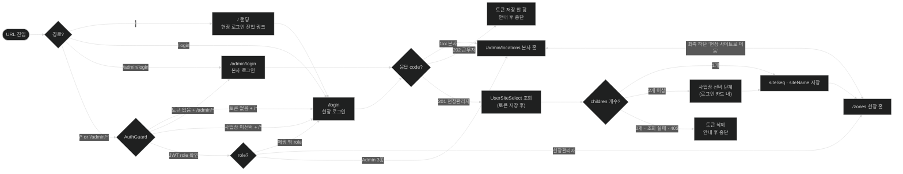

**규칙**

- `/` = 정적 랜딩(공개). 현장 로그인 링크만 노출. 본사 로그인 링크 미노출.
- `/login` = 현장 로그인. 현장관리자/Admin 3종 모두 사용.
- `/admin/login` = 본사 로그인. URL 직접 접근. 시스템관리자/Master/Manager 사용.
- `/*` 미인증 → `/login`. `/admin/*` 미인증 → `/admin/login`.
- 🔴 **현장 영역은 사업장 미선택도 차단한다**(021). 토큰이 멀쩡해도 `siteSeq`가 없으면 `/login`으로 되돌린다 — `siteSeq` 없이 조회하면 403이 아니라 `200` + 빈 목록이 와서(`api-spec.md:211`) 정상 응답인 빈 화면이 그려진다. **본사 영역은 이 체크에서 제외**.
- 🔴 **근무자 차단은 로그인 응답 시점**이다(020 실구현). 가드가 아니라 로그인 화면이 막는다 — 서버는 근무자에게도 토큰을 발급하므로(`code: 202`) **토큰을 저장하지 않고** 안내 후 중단한다. 저장 후 가드로 막으면 새로고침 시 통과할 여지가 생긴다.
- **착지 사이트는 응답 `code`가 정한다**(`1xx` 본사 / `2xx` 현장). 로그인 화면이 어느 쪽이었는지와 무관하다 — `/admin/login`에서 현장 계정으로 들어오면 현장 홈으로 간다. 로그인 엔드포인트는 `Login/W/Login` **하나뿐**이다(`api-spec.md` §1-1).
- **권한 판단은 JWT `role`**이 하고, `code`는 저장하지 않는다(`CLAUDE.md` B4). JWT `role`이 매핑 밖 값이면(미실측 3종) 권한을 특정할 수 없어 가드가 로그인으로 보낸다.
- Admin 3종은 양쪽 사이트 모두 진입 가능(단, 시작은 `code`가 정한 사이트). 본사 사이트 좌측 하단 "현장 사이트로 이동" 링크로 횡단.
- 현장관리자는 `/*`만. `/admin/*` 접근 시 403 또는 본인 영역 홈 리다이렉트(정책 미정).

> **해소(020, 2026-10-06)**: 로그인 직후 첫 화면은 **현장 `/zones` · 본사 `/admin/locations`**다(`homePath()`·`paths`와 일치). 당초 현장 홈을 사이드바 첫 메뉴인 `/patrol/zones`로 잠정 가정했으나 코드는 `/zones`(순찰코스 관리)였고, 코드 쪽을 유지하기로 결정했다.
>
> **해소(021, 2026-10-07)**: 사업장 선택 단계가 로그인과 홈 사이에 들어갔다(위 다이어그램 반영).
>
> - **라우트가 아니라 로그인 카드 안의 단계**다. 선택 중에도 주소는 `/login` 그대로다 — 선택 확정 API가 없어 이 단계는 "목록 1회 조회 + 로컬 저장"뿐이라 라우트·가드를 둘 무게가 아니었다.
> - 현장은 **1개면 자동 진입**(선택 UI 스킵, 저장은 그대로), 2개 이상이면 선택. **0개·조회 실패·403은 토큰을 지우고 중단**한다.
> - **본사는 선택 단계가 없다**(현행 유지). 본사 홈이 아직 placeholder라 `siteSeq` 소비처가 0개이고, `AdminSiteSelect` 평면 배열 응답이 미실측이다 → Phase 5에서 추가(`api-spec.md` OQ-1B).
> - `UserSiteSelect`는 `sign` 엔드포인트라 **토큰 저장이 호출보다 먼저**다. 그래서 "토큰 있음 + `siteSeq` 없음" 중간 상태가 생기고, **`AuthGuard`가 현장 영역에서 그 상태를 로그인으로 되돌린다**(본사 영역은 제외).

---

## 1. `/*` — 현장 운영 사이트 (현장관리자 기준)

### 1-1. 사이트맵

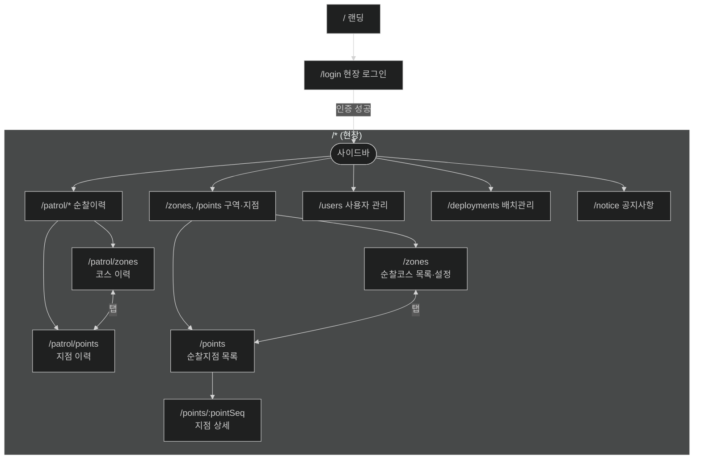

**탭 그룹**

- `/patrol/zones` ↔ `/patrol/points` — 순찰이력 탭(`PatrolLayout`)
- `/zones` ↔ `/points` — 구역·지점 탭(`CourseTabs`)
- `/points` → `/points/:pointSeq` — 행 클릭으로 상세 진입(`spec 027`). 🔴 **상세가 라우트라 새로고침·딥링크·뒤로가기가 보존된다** — 027 전에는 선택이 `useState` 였다. 상세의 브레드크럼 첫 조각이 목록 복귀 링크를 겸한다

### 1-2. 화면 간 이동 (모달·액션 포함)

페이지 단위 이동은 사이드바·탭이 대부분이고, 실 작업은 **모달**로 처리된다.

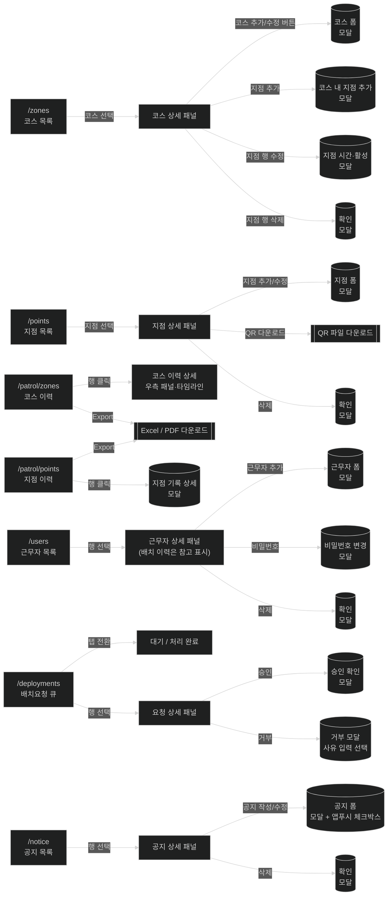

**원칙**

- 좌측 목록 → 우측 상세 패널 패턴이 거의 모든 화면 공통.
- 모달 닫힘 → 직전 페이지로 복귀(URL 변경 없음). 검색 상태는 URL 쿼리스트링이라 영향 없음.
- 모든 검색·필터는 URL 쿼리스트링에 저장 → 새로고침 보존, 뒤로가기로 이전 필터 복원.

### 1-3. 주요 시나리오

#### S1. 첫 로그인 → 근무자 등록

현장관리자가 새 근무자를 자기 사업장 소속으로 등록. 사업장 이동(파견/복귀)은 근무자가 APP에서 요청하는 방식 → **S1-A** 참조.

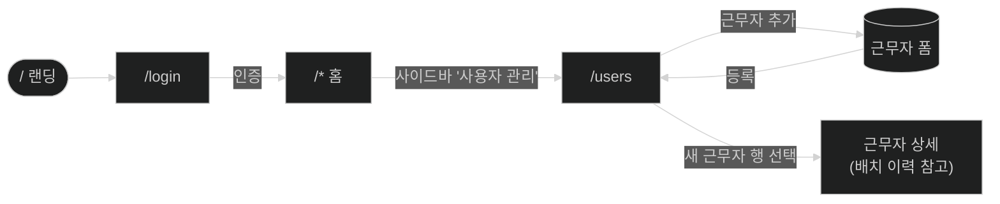

#### S1-A. 배치 요청 승인 / 거부 (신규)

근무자가 APP에서 배치·복귀를 요청하면 **목적지 사업장 관리자**의 큐에 진입.
관리자 액션은 승인·거부 2가지. 근무자는 언제든 취소 가능.

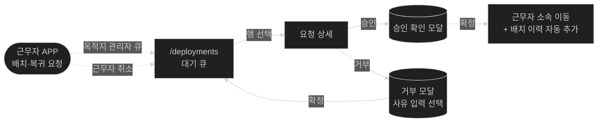

#### S2. 순찰지점 신규 + 순찰코스 구성

지점을 먼저 만들고, 코스에 묶고, 순서·소요시간을 설정.

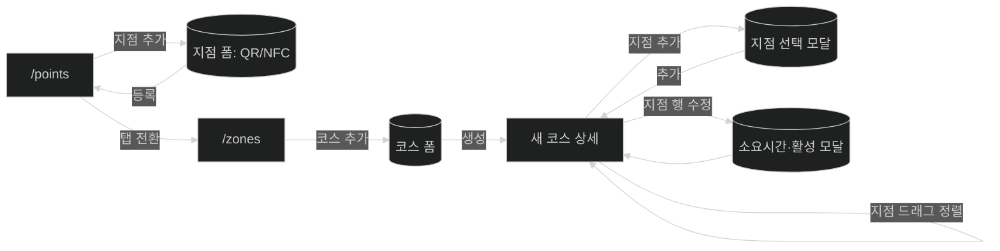

#### S3. 순찰이력 조회 → 상세 → Export

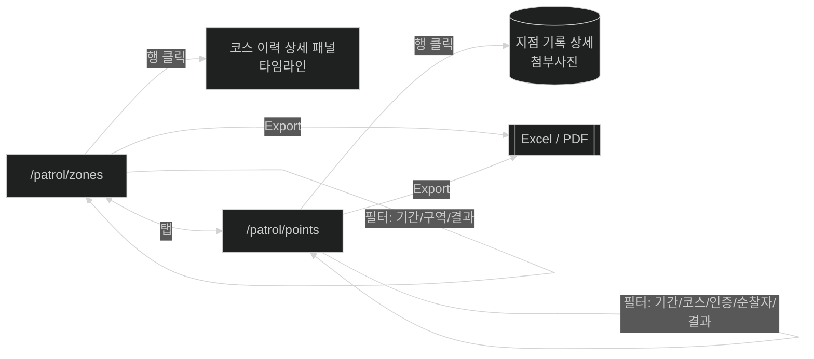

#### S4. 공지사항 작성 → APP 알림 트리거

---

## 2. `/admin/*` — 본사 관리 사이트 (시스템관리자 기준)

### 2-1. 사이트맵

### 2-2. 화면 간 이동 (모달·액션 포함)

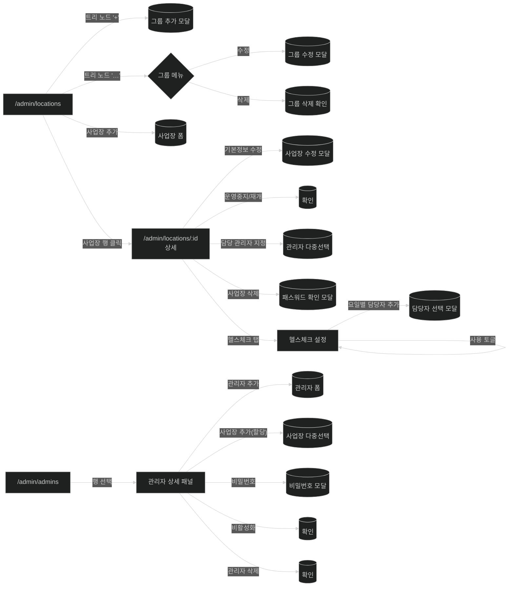

### 2-3. 주요 시나리오

#### A1. 신규 사업장 온보딩

그룹 트리 생성 → 사업장 추가 → 담당 관리자 지정 → 헬스체크 설정.

#### A2. 관리자 신규 + 사업장 할당

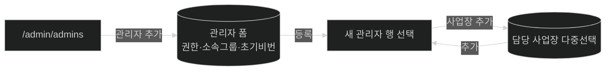

**권한 규칙**

- 시스템관리자 → Master 생성 가능
- Master → Manager 생성 가능
- Manager → 사용자 생성 불가 (할당받은 사업장만 관리)

#### A3. 사업장 삭제 (위험 동선)

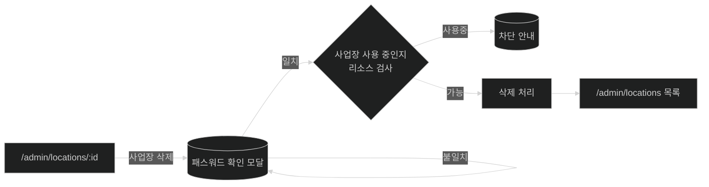

> **Open**: 사업장 사용 중일 때(=배치된 근무자·진행 중 코스 존재) 차단 로직은 백엔드 책임인지, 프론트 사전 안내가 필요한지 미정.

---

## 3. 횡단 / 공통 흐름

### 3-1. 검색·필터 상태 보존

모든 목록 화면에서 검색·필터는 **URL 쿼리스트링**에 저장.

### 3-2. 가드 실패 / 오류

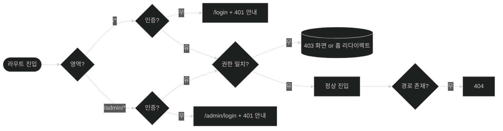

> **Open**: 403일 때 별도 화면을 보여줄지, 본인 영역 홈으로 리다이렉트할지 미정(screens.md Open Q와 동일).

---

## 4. Open Questions

- [ ] 로그인 직후 첫 화면(현장 / 본사 각각의 "홈")의 명시적 라우트
- [ ] 403 발생 시 정책: 별도 화면 vs 본인 영역 홈 리다이렉트
- [ ] 사업장 삭제 시 사용 중 검사의 책임 위치(프론트 사전 안내 여부)
- [ ] 사이트 간 전환(`/admin/*` ↔ `/*`) 시 직전 위치 기억 필요 여부
- [ ] 모달 내부에서 다른 모달로 체이닝되는 동선(예: 사업장 상세 → 담당 관리자 지정 모달 → 관리자 신규 모달)의 허용 깊이
