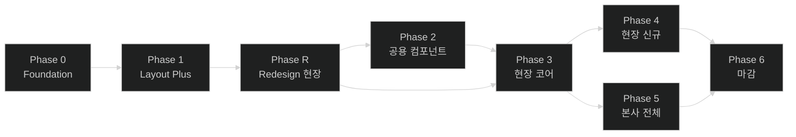

# 작업 로드맵 (roadmap.md)

> 본 문서는 [`screens.md`](./screens.md)의 화면 진행도(✓/△/✗)와 그동안 정리된 결정/Open Question을 종합한 **작업 순서**다.
>
> **원칙**
> - 화면보다 **인프라·공통**이 먼저 (Foundation 우선).
> - 위험도 A 화면은 안정된 공통 위에서 만든다.
> - 화면 작업은 현장(`/*`) → 본사(`/admin/*`) 순서 (1차 타겟 = 현장관리자).
>
> **항목 표기**
> - 위험도: A(치명적) / B(일반 CRUD) / C(정적)
> - 의존성: 이 항목을 시작하려면 끝나야 하는 선행 항목
> - 비고: 관련 문서/결정 링크

---

## 1. 우선순위 원칙

1. **인프라/공용**(Phase 0~2)이 화면 작업(Phase 3~5)에 선행한다.
2. **권한·인증 흐름**은 어떤 화면보다도 먼저 안정화한다.
3. **위험도 A 화면**(인증/권한/데이터 변형)은 토큰·가드·DTO가 확정된 뒤 시작한다.
4. 현장(`/*`)은 본사(`/admin/*`)보다 먼저. 명세서가 "여기에 가장 공들임"이라 명시.
5. **점진 마이그레이션 우선** (예: AppButton). 한 번에 전수 교체 금지(A3 최소 변경).

---

## 2. Phase 한눈에

| Phase | 테마 | 핵심 산출물 | 주 위험도 |
|---|---|---|---|
| **0** | Foundation | path 상수 / env / axios + `ApiResponse` 인터셉터 / 401 refresh / react-query / enum SSOT / `useQueryParams` / `<RequireRole>` / **sonner toast** / **MSW** / **AppFormField 분석·도입** | A |
| **1** | Layout Plus | AuthGuard 실제화 / 모바일 햄버거+Sheet / 본사 사이드바 config / TopNav 메뉴명 매핑 / ProfileBadge 메뉴 / 401·403·404 / AppTable 페이지네이션 / AppButton 마이그레이션 착수 | A·B |
| **R** | **Redesign (현장 사이트)** | **Pretendard + OKLCH 토큰 매핑 / `ServiceLayout` + 68px `RailSidebar` + 페이지 자연 스크롤 / 공용 컴포넌트(AppPageHeader · AppFilterButton · AppPagination · AppDetailCard · AppKpiCard · 결과 뱃지 5종) / 현장 5개 화면(순찰이력·코스/지점·근무자·배치관리·공지사항) UI 전면 교체** | **A·B** |
| **2** | 공용 컴포넌트 확충 | **AppSelect / AppDatePicker** (017에서 2종으로 재산정 — dnd-kit·첨부위젯은 수요 화면으로, 알림시트는 Phase 5로 이동. §6 참조) | B |
| **3** | 현장 코어 △→✓ | `/login` / `/zones` 디테일 / `/points` 디테일 / `/patrol/zones` 디테일 / `/patrol/points` 신규 / Export | A·B |
| **4** | 현장 신규 영역 ✗→✓ | `/users` / `/notice` / `/settings/keywords` | B·C |
| **5** | 본사 영역 전체 | `/admin/login` / `/admin/locations`(+상세+헬스체크) / `/admin/admins`(+할당) | A |
| **6** | 마감 | 권한 매트릭스 검증 / 접근성 / 콘텐츠 톤 점검 / AppButton 마이그레이션 완료 / 성능 점검 / 정리 | — |

> **Phase R 삽입 사유**: 2026-07-23 리디자인 결정으로 현장 사이트 UI를 Notion/Linear/Vercel 계열로 전면 교체. 셸 자체가 바뀌므로 Phase 2/3의 화면 작업이 신규 셸 위에서 얹혀야 함. 데이터·기능·문구는 유지, UI만 교체. `/admin/*`(본사)은 이번 라운드 미적용 → Phase 5에서 별도 처리.

---

## 3. Phase 0 — Foundation (인프라)

화면이 의존하는 코어. 여기 늦으면 나중에 전수 수정 비용.

Phase 0은 spec 단위로 4개로 분할: **001-api-foundation** / **002-lint-cleanup** / **003-auth-foundation** / **004-dev-infrastructure**.
폴더는 Phase별로 묶는다: `specs/phase0/{001,002,003,004}-*/`. (번호는 Phase 무관 글로벌 일련번호)

| 항목 | 결과물 | 소속 spec | 의존성 | 비고 |
|---|---|---|---|---|
| axios 인스턴스 | `lib/axios.ts` | 001 | env | baseURL + 토큰 헤더 |
| **응답 인터셉터** | `ApiResponse<T>` unwrap + `code !== 200` throw | 001 | axios | `data-model.md` §2-1, §6 |
| react-query 셋업 | `QueryClientProvider` + 기본 옵션 + `select` 변환 규칙 | 001 | axios | DTO→ViewModel 변환은 select에서 |
| **sonner toast** | `<Toaster>` 마운트 + 기본 옵션 + 헬퍼(`toast.success`/`toast.error`) | 001 | — | `design-system.md` D6 |
| 사전 lint 정비 | 기존 lint 19건 해소 → `npm run verify` green | 002 | — | 001 이월. zone form / points·zones page / AuthGuard 등 본 spec 범위 밖이던 기존 에러 |
| **401 → refresh** | `/auth/refresh` 자동 호출 + 재시도 + 실패 시 영역별 로그인 이동 | 003 | 인터셉터 | `data-model.md` §4-3, `flow.md` §3-2 |
| 권한 가드 헬퍼 | `<RequireRole roles={[...]}>` | 003 | useMe 훅 | 화면 내 액션 권한 |
| `useMe()` 훅 | `MeDto` 상태 + 새로고침 시 `/auth/me` 동기화 | 003 | react-query | `data-model.md` §4-3 |
| 라우트 상수 SSOT | `src/router/paths.ts` | 004 | — | `screens.md` §4 라우트 매핑 |
| env 분기 | `VITE_API_BASE_URL` 등 | 004 | — | 테스트=IP / 운영=도메인+prefix (`data-model.md` §4) |
| Enum SSOT | `src/types/enum.ts` + 라벨 매핑 | 004 | — | `data-model.md` §2-2 |
| `useQueryParams` 헬퍼 | URL 쿼리스트링 표준 접근 | 004 | — | `patterns.md` §6 |
| **MSW 도입** | `src/mocks/handlers/*` + 개발용 worker 마운트 | 004 | react-query | 기존 `features/{도메인}/mock/*` 이관 |
| **vitest 셋업** | `vitest.config.ts` + `@testing-library/react` + `package.json` 스크립트(`test`, `test:watch`) | 004 | MSW | `workflow-protocol.md` WF-4 검증 인프라. 백엔드 연결 전엔 MSW 기반 단위/통합 테스트 |
| **AppFormField 분석·도입** | 폼 컨테이너 컴포넌트 + AppInput 폼 영역 정리 | 004 | — | `design-system.md` §6 Open Q 해소. Phase 3 폼 작업 전 필수 |
| Error Boundary (전역) | 페이지 단위 fallback | 004 | — | 안전망 |

**Phase 0 종료 조건(DoD)**
- 새 화면이 axios·react-query·toast·가드를 **표준 사용법대로** 호출할 수 있다.
- `npm run verify` 통과.
- `design-system.md` §6의 "AppFormField 도입 분석" Open Q 해소.

---

## 4. Phase 1 — Layout Plus (셸 확장)

화면 작업 가능한 최소 셸 완성.

| 항목 | 결과물 | 의존성 | 비고 |
|---|---|---|---|
| AuthGuard 실제화 | `isAuthentication = true` 제거 + 실 토큰 검사 + role 분기 | Phase 0 인증 셋업 | `flow.md` §0 |
| 모바일 햄버거 + Sidebar Sheet | TopNav 좌측 햄버거(`lg:hidden`) + 사이드바를 `ui/sheet`로 감쌈 | — | `layout.md` §5-6 |
| 본사 사이드바 config 분리 | `AdminMenus` export | — | `layout.md` §6 |
| TopNav 메뉴명 매핑 | 라우트 → 메뉴명 lookup | path 상수 | `layout.md` §6 |
| ProfileBadge 드롭다운 | 로그아웃 / 내 정보 | useMe | `layout.md` §6 |
| 401·403·404 화면 | 각 상태 페이지 컴포넌트 + 라우트 등록 | — | `screens.md` §3, `flow.md` §3-2 |
| AppTable 페이지네이션 UI | 페이지 번호·이전/다음·전체 표시 | Phase 0 page 1-based | `components.md` §9, `data-model.md` §2-1 |
| AppButton 마이그레이션 (착수) | 새 화면 = AppButton만. 기존 = 화면 작업 시 함께 교체 | — | `design-system.md` D1 |

**Phase 1 종료 조건**
- 모바일에서 사이드바 동작 확인.
- 새 화면이 페이지네이션 컴포넌트 그대로 사용 가능.
- 비인증 진입 시 라우트별 적절한 로그인 화면으로 리다이렉트 검증.

---

## 5. Phase R — Redesign (현장 사이트 UI 전면 교체)

> **배경**: 2026-07-23 결정. 1차 시안이 "장난감 같다"는 피드백 → Notion / Linear / Vercel 계열 미니멀·고밀도 SaaS 스타일로 전환. 데이터·기능·문구는 유지, UI만 교체.
> **범위**: 현장 사이트(`/*`) 전체 셸 + 5개 화면(순찰이력·코스/지점·근무자·배치관리·공지사항).
> **범위 밖**: `/admin/*` 본사 사이트, 로그인/랜딩 → Phase 5에서 별도 처리.
> **입력 문서**: [`docs/new-design-note.md`](./new-design-note.md), [`docs/ui-mock/현장/**/*-신규.png`](./ui-mock/), [`docs/design-system.md`](./design-system.md) D10, [`docs/layout.md`](./layout.md) §0·§2, [`docs/screens.md`](./screens.md) §1-2~§1-5.

### 5-1. 페이즈 구조 (R0 → R1 → R2 → R3)

| 단계 | 성격 | Spec | 병렬 가능? |
|---|---|---|:-:|
| **R0** | 기반 (블로킹) | 007 (단일 통합) | X (선행 필수) |
| **R1** | 공용 컴포넌트 | 008 (단일 통합) | R0 완료 후 시작 |
| **R2** | 화면별 리디자인 | 009 ~ 015 (7개 spec) | R1 완료 후, 화면 간 병렬 가능 |
| **R3** | 회귀 확인 | 016 | R2 전체 완료 후 |

### 5-2. Spec 인벤토리

| Spec ID | 폴더 | 성격 | 위험도 | 라우트 | 비고 |
|---|---|---|:-:|---|---|
| **007** | `specs/phaseR/007-redesign-foundation/` | R0. Pretendard 폰트 + OKLCH 토큰 매핑 + `--rail`/`--rail-2` 신설 + **라우터 레벨 `ServiceLayout`/`AdminLayout` 분리** + 68px `RailSidebar` 신규 + 페이지 자연 스크롤 정책 전환 | **A** | (셸) | 이후 모든 화면의 전제 조건 |
| **008** | `specs/phaseR/008-redesign-shared-components/` | R1. `AppPageHeader` / `AppFilterButton` / `AppPagination`(리뉴얼) / `AppDetailCard` / `AppKpiCard` / 결과 뱃지 5종 variant 추가 | B | (컴포넌트) | R2에서 재사용 |
| **009** | `specs/phaseR/009-patrol-history-zone/` | R2-1. 순찰이력 코스 탭 리디자인 | B | `/patrol/zones` | 마스터-디테일 카드화, 특이사항 자동펼침 |
| **010** | `specs/phaseR/010-patrol-history-point/` | R2-2. 순찰이력 지점 탭 (신설) + 기록 상세 모달 | B | `/patrol/points` | screens.md §1-2 진행도 ✗ → ✓ |
| **011** | `specs/phaseR/011-course-management/` | R2-3. 코스 탭 + 경로 다이어그램 카드 신규 | B | `/zones` | zigzag 다이어그램, 4개마다 줄바꿈, 좁은 폭 숨김 |
| **012** | `specs/phaseR/012-point-management/` | R2-4. 지점 탭 (편집 모달 유지) | B | `/points` | 상세 카드 확장 |
| **013** | `specs/phaseR/013-workers/` | R2-5. 근무자 관리 (신규 라우트) | B | `/users` | 배치변경 버튼 제거, 메뉴명 "근무자" |
| **014** | `specs/phaseR/014-deployments/` | R2-6. 배치관리 대시보드 (신규 라우트, 신규 워크플로) | **A** | `/deployments` | KPI + 인라인 승인/거부 + 거부 사유 모달 + 이력 탭 |
| **015** | `specs/phaseR/015-notice/` | R2-7. 공지사항 (다른 화면과 동일 컨셉 자동 적용) | B | `/notice` | 별도 목업 요청 없음 |
| **016** | `specs/phaseR/016-redesign-regression/` | R3. 본사 사이트 미영향 + 로그인/랜딩 미영향 + 접근성/콘텐츠 톤 회귀 | C | (전역) | 리디자인 마감 |

### 5-3. Phase R 종료 조건 (DoD)

- 현장 사이트 5개 화면이 모두 신규 셸(`ServiceLayout` + `RailSidebar`)에서 렌더링되고 `docs/ui-mock/현장/**/*-신규.png`와 시각적으로 일치.
- `/admin/*` 본사 사이트는 기존 셸(`AdminLayout` + `Sidebar` w-70 + `TopNav`)로 그대로 동작 (리디자인 미적용).
- 로그인/랜딩 페이지 미영향.
- `npm run verify` + `npm run test` green.
- `screens.md` §1-2~§1-5의 진행도 컬럼과 §4 라우트 매핑이 리디자인 완료 상태로 동기화.

### 5-4. Phase R 이후 (Phase 2~4)

- 원래 Phase 2 (공용 컴포넌트 확충)는 리디자인 이후에도 여전히 필요 (`AppSelect`/`AppDatePicker`/dnd-kit Provider 등은 리디자인 범위 밖).
- Phase 3/4의 화면 작업은 이제 **리디자인된 셸 위에서** 진행. 화면별 진행도 △/✗을 ✓로 마감하는 작업은 그대로 유효하되, 리디자인 결정에 맞춰 세부 스펙 재확인 필요.

---

## 6. Phase 2 — 공용 컴포넌트 확충

> **2026-09-29 재산정(017)**: 원안은 5개 항목을 "Phase 3에서 막히지 않도록 미리" 묶어둔 것이었다. Phase R 완료 후 코드에서 소비처를 실제로 세어 보니 **수요가 복수 화면에 걸친 것은 2종뿐**이었다. 나머지는 단일 화면에 국한되거나(1곳) 현장에서 소멸(0곳)해, 미리 만들면 A3(최소 변경)·A6(미래 확장 포인트 금지)에 어긋난다. 따라서 Phase 2를 2종으로 좁히고 나머지는 이동한다.

### 6-1. Phase 2 범위 (017)

| 항목 | 결과물 | 확정 수요 | 소속 spec |
|---|---|---|---|
| `AppSelect` | 단일 선택 드롭다운 | **9곳** — 필터 8(`/patrol/zones` 2·`/patrol/points` 4·`/users` 2) + `AppPagination` 행수 1 | 017 |
| `AppDatePicker` | 날짜 **범위** 선택 | **2곳** — `/patrol/zones`·`/patrol/points` 기간 선택 | 017 |

- `AppSelect` 다중 선택, `AppDatePicker` 단일 날짜는 **확정 수요 0곳이라 미구현**. 필요해질 때 확장(기존 호출부 무변경).

### 6-2. 원안에서 이동한 항목

| 항목 | 확정 수요 | 이동 위치 | 사유 |
|---|---|---|---|
| dnd-kit Provider | 1곳 (`/zones` 지점 드래그 정렬) | 해당 화면 실동작 작업 시 | 단일 화면용 추상을 미리 만들 이유 없음 |
| Notice 첨부 업로드 위젯 | 1곳 (`/notice`) | 해당 화면 첨부 실동작 작업 시 | 상동 |
| 알림 시트 본문 | **0곳 (현장)** | **Phase 5 (본사)** | `AlarmSheet`는 `TopNav.tsx`에 있고 007에서 `TopNav`가 `AdminLayout` 전용이 됨. 현장 코드에 참조 0건 — 애초에 현장 공용 컴포넌트가 아니었음 |

**Phase 2 종료 조건**
- 순찰이력·근무자 화면의 필터 팝오버를 조립할 수 있는 선택 계열 primitive가 갖춰진다(018에서 실제 조립).

---

## 7. Phase 3 — 현장 코어 화면 마감 (△ → ✓)

screens.md 진행도 △ 일괄 마무리. 위험도 A 우선.

| 항목 | 라우트 | 위험도 | 상태 | 비고 |
|---|---|:-:|:-:|---|
| 로그인 실구현 | `/login` | A | ☑ | **020 완료.** zod 검증 + `code` 기반 사이트 분기 + 근무자 차단. `/admin/login`도 같은 폼으로 함께 구현 |
| 코스 추가/수정/삭제 | `/zones` 모달 | A | △ | 폼 + 확인 모달 |
| 코스 내 지점 드래그 정렬 | `/zones` | A | △ | dnd-kit + `ReorderCoursePointsRequest` |
| 코스 내 지점 시간/활성 모달 | `/zones` 모달 | A | △ | `UpdateCoursePointRequest` |
| 지점 추가/수정 | `/points` 모달 | A | ☑ | **022 완료.** NFC HEX 14자리 검증(zod) + 실 API(POST/PATCH). 편집은 모달 유지 |
| 지점 QR 다운로드 | `/points` 액션 | A | △ | 파일 다운로드 |
| 지점 삭제 | `/points` 액션 | A | ☑ | **022 완료.** 프론트 선제 차단 없이 호출하고 서버 거부 사유를 노출. ⚠️ `usedCount > 0` 거부 여부는 **미실측**(OQ-022-B) — 확인은 코스 편성 API(023) 이후 |
| 코스 이력 필터·상세 | `/patrol/zones` | B | △ | URL 쿼리스트링 / 타임라인 / `useQueryParams` |
| 지점 이력 + 기록 상세 | `/patrol/points` | B | ✗ | 신규. 모달 상세 포함 |
| 이력 Export | 액션 | B | ✗ | Excel / PDF. 두 이력 공용 |

**Phase 3 종료 조건**
- screens.md 1-2/1-3의 진행도가 모두 ✓.
- 실 API 또는 MSW로 동작 확인.

### 7-1. 실 API 전환 spec 번호 (확정 2026-10-06 — **번호의 SSOT**)

> 019를 "통신 계약"으로 좁히면서 뒤 번호가 한 칸씩 밀렸는데 본 문서가 갱신되지 않아
> 같은 번호가 세 군데에서 다른 것을 가리켰다(§13 MSW 항목 = 020:순찰지점 / §12 018 행 =
> 022:지점이력 / `019/spec.md` = 022:순찰지점). **`019/spec.md`의 체계로 통일한다** —
> 019가 이미 `spec 021`(사업장 선택)·`022`(순찰지점 CRUD)·`024`·`025`를 본문에서
> 참조하고 있어 그쪽이 다수이자 선행이다. 앞으로 번호는 **이 표가 SSOT**다.

| spec | 범위 | 상태 | 번호 근거 |
|---|---|:-:|---|
| **019** | api-contract — 통신 계약(응답 unwrap·에러 정규화·토큰 재발급) | ☑ | — |
| **020** | **실 로그인 + JWT 전환** — 로그인 폼·`code` 라우팅·근무자(`202`) 차단·`useMe`를 JWT 디코딩으로 교체·MSW `me` 핸들러 및 `DEV_ROLE_KEY` 제거 | ☑ | `019/spec.md:75·82·146`, `019/tasks.md` 이월 블록 |
| **021** | **사업장 선택 — 현장만** — `UserSiteSelect`·0/1/N 분기·`siteSeq` 저장·`AuthGuard` 미선택 차단. 본사(`AdminSiteSelect`)는 Phase 5로 이동 | ☑ | `019/spec.md:89` "접근 가능 사업장 제한은 `spec 021` 책임" |
| **022** | 순찰지점 — **변경계(POST/**PATCH**/DELETE) 첫 적용**. OQ-E 실측 지점 | **◩** | `019/spec.md` OQ-E · 🔴 **`PUT` 아니라 `PATCH`**(swagger 실측, 022에서 교정) |
| **027** | **순찰지점 화면 재구성** — 좌/우 마스터-디테일 → **목록 페이지 + 상세 페이지**(라우트 분리). 필터·검색·페이지 이동을 **새 구조 안에서** 수행(022 US5 이월) | ☑ | 사용자 결정 2026-10-08. ⚠️ **번호는 맨 뒤를 쓴다** — `023~026` 이 여러 문서에서 이미 참조돼 밀면 2026-10-06 재정렬 사고가 반복된다. 🔴 **실행 순서는 `022 → 027 → 023`** 이고 번호 순서와 다르다 |
| **023** | 순찰코스 | ☐ | ⚠️ 추론 — 019에 명시 참조 없음. §13 전환 순서(지점→코스)와 전후 번호로 역산 🔴 **착수 전 WF-1-0 필수**(`workflow-protocol.md` §1) — `AddCourse`·`UpdateCourse`·`DeleteCourse` 실측. ⚠️ **`UpdateCourse` 는 `PUT`** 이라 PATCH 인 지점과 부분 갱신 동작이 다를 수 있다 ✅ **WF-1-0 완료(2026-10-10)** — 변경계 3종 실측. 🔴 **범위 확정: API 전환 + 화면 재구성(A구조)** — 지점을 012→022→027 로 두 번 갈아엎었으므로 코스는 한 번에 한다 |
| **024** | 지점 순찰이력 — 018 필터 이월분(T158·T160·T161)·결과 뱃지 5종 ↔ 서버 `status` 정리 | ☐ | `019/spec.md:14·18` |
| **025** | 코스 순찰이력 — 018 `filterCourseHistory.ts` 정리·페이지네이션 URL 이관 | ☐ | `019/spec.md:15·17` |
| **026** | 공지사항 | ☐ | ⚠️ 추론 — 019 `spec 020~026`(7개)의 마지막 칸. §13 전환 순서상 공지사항 |

**020 / 021 분리 근거**

- **020 안에서 로그인과 JWT 전환은 쪼갤 수 없다.** 토큰이 없으면 디코딩할 것이 없고, JWT 전환 없이 로그인만 붙이면 `useMe`가 실재하지 않는 `/api/auth/me`를 호출한다. `019/tasks.md` 이월 블록에 "둘은 같은 커밋이어야 한다"로 이미 고정했다. 런타임 소비처 12개 파일이 한 번에 움직이는 것이 020의 실제 무게다.
- **021은 쪼갤 수 있다.** 020은 "로그인 → 홈 진입"까지만 책임지고, 021이 그 사이에 선택 단계를 삽입한다. 현장/본사가 **API·필드명·분기 규칙이 전부 다르고**(`api-spec.md` §2-2) `siteSeq` 전달 규약까지 포함해 단독으로 충분한 분량이다.
- **021은 022보다 앞이어야 한다.** 화면 연동 spec은 전부 `siteSeq`를 쿼리에 실어야 하고, 권한 밖 값은 403이 아니라 `200` + 빈 목록으로 돌아와 응답으로 구분할 수 없다(`api-spec.md:212`). 선택 목록을 먼저 확보해야 그 값을 검증할 수 있다.

---

## 8. Phase 4 — 현장 신규 영역 (✗ → ✓)

| 항목 | 라우트 | 위험도 | 비고 |
|---|---|:-:|---|
| 근무자 목록 + 상세 | `/users` | B | 검색·필터 + 마스터-디테일 |
| 근무자 추가/수정 | 모달 | B | 현장관리자만 생성 |
| 배치관리(신규) | `/deployments` | A | 근무자 APP 요청 → 목적지 관리자 승인/거부. `ApproveDeploymentRequest` / `RejectDeploymentRequest` |
| 공지 목록 + 상세 | `/notice` | B | 마스터-디테일 + 첨부 표시 |
| 공지 작성/수정/삭제 | 모달 | B | "저장 시 앱 푸시" 체크박스 |
| 환경설정 — 키워드 | `/settings/keywords` | C | UX TBD. 후순위 가능 |

**Phase 4 종료 조건**
- screens.md 1-4/1-5의 진행도가 모두 ✓ (키워드는 UX 확정 후).

---

## 9. Phase 5 — 본사 영역 전체

전부 ✗에서 시작. 거의 다 위험도 A.

| 항목 | 라우트 | 위험도 | 비고 |
|---|---|:-:|---|
| ~~본사 로그인~~ | `/admin/login` | A | **`spec 020`이 흡수(2026-10-06)** — 로그인 엔드포인트가 하나뿐이어서 현장 폼을 그대로 재사용했고, 020의 JWT 전환으로 임시 진입 버튼이 동작 불가가 되어 미룰 수 없었다. Phase 5 범위 아님 |
| **본사 사업장 선택** | (로그인 카드 내 단계) | A | **`spec 021`에서 이월(2026-10-07)** — 021은 현장만 했다. 본사 홈이 placeholder라 `siteSeq` 소비처가 **0개**였고, `AdminSiteSelect` 평면 배열 응답이 미실측이다(`api-spec.md` OQ-1B). 현장 구현에 `SiteSelectStep`·`SiteOption`·저장소가 이미 있으니 **어댑터 1개 + 호출 분기**만 추가하면 된다. 🔴 함께 할 일: `AuthGuard`의 `siteSeq` 체크에서 **본사를 제외한 예외를 걷어낸다**(`AuthGuard.tsx`의 `isAdmin` 분기) |
| 관리자 목록 + 상세 | `/admin/admins` | B | 검색·필터·마스터-디테일 |
| 관리자 추가 | 모달 | A | 권한별 생성 제한(시스템→Master, Master→Manager) |
| 사업장 할당 모달 | 모달 | A | 다중 선택 |
| 관리그룹 트리 | `/admin/locations` 좌측 | A | Level 3, +/⋯ 컨텍스트 |
| 사업장 목록 | `/admin/locations` 우측 | A | 검색 + 운영상태 필터 |
| 사업장 추가/수정 | 모달 | A | 계약기간 포함 |
| **사업장 삭제** | 모달 | A | **패스워드 재확인** (`patterns.md` §4) |
| 사업장 상세 — 기본정보 | `/admin/locations/:id` | A | 담당 관리자 지정 섹션 |
| 사업장 상세 — 헬스체크 + 비상연락망 | `/admin/locations/:id?tab=health` | A | 요일별 담당자 다중 |

**Phase 5 종료 조건**
- screens.md §2 진행도가 모두 ✓.
- 권한별 데이터 스코프 동작 검증(Manager는 할당 사업장만 보임).

---

## 10. Phase 6 — 마감

| 항목 | 비고 |
|---|---|
| 권한 매트릭스 전수 검증 | `<RequireRole>` 누락 점검, 화면×역할 매트릭스 |
| 접근성 최종 검토 | 포커스 링·키보드 동선·색 대비 |
| 콘텐츠 톤 점검 | 확인 문구·빈 상태·에러 메시지 일관 (`design-system.md` §4) |
| **AppButton 마이그레이션 완료** | shadcn `ui/button.tsx` 제거 (`design-system.md` D1) |
| 성능 점검 | 테이블·트리 가상화 여부 / 큰 목록 페이지 |
| mock/주석 정리 | 사용 안 하는 mock 제거 |
| `screens.md` 진행도 일괄 ✓ 확인 | 진행도 컬럼 최종 동기화 |

---

## 11. 의존성 도식

- Phase R은 Phase 1 완료 후 시작. 현장 셸 자체가 바뀌므로 Phase 2/3의 화면 작업이 Phase R 이후에 얹혀야 함.
- Phase R 내부: R0(007) → R1(008) → R2(009~015, 화면 간 병렬 가능) → R3(016).
- Phase 5(본사)는 리디자인 미적용이라 Phase R과 무관하게 진행 가능. 다만 Phase R에서 라우터 분리(`ServiceLayout`/`AdminLayout`)가 이뤄지므로 Phase 5는 그 위에서 안전.
- Phase 4·5는 인력이 있다면 병렬 가능(공통 위에서 도메인이 갈리므로).

---

## 12. 진행 추적 매트릭스

각 Phase 끝나면 해당 줄에 ✓.

| Phase | DoD 통과 | 비고 |
|---|:-:|---|
| 0 Foundation — 001 api | ☐ | axios·react-query·sonner |
| 0 Foundation — 002 lint cleanup | ☑ | 사전 lint 19건 해소 (001 이월). T029 수동 회귀만 003에서 마무리 |
| 0 Foundation — 003 auth | ☑ | 401 single-flight refresh + 요청 인터셉터 토큰 부착 + `useMe`(MeRaw→MeDto select) + `<RequireRole>` UI 액션 가드 + 토큰/리다이렉트 헬퍼. AuthGuard 본체 연결과 002 T029 수동 회귀는 Phase 1로 이월 |
| 0 Foundation — 004 dev infra | ☑ | paths SSOT + `.env.example` + Enum SSOT + `useQueryParams` + MSW(auth 핸들러 + browser/server + opt-in `VITE_USE_MSW`) + vitest(jsdom + RTL + jest-dom) + AppFormField(D9) + AppErrorBoundary + 라우트 `errorElement`. AuthGuard 실제화는 Phase 1로 이월 |
| 1 Layout Plus — 005 auth/error | ☑ | AuthGuard 실제화(토큰·useMe 분기, 영역별 로그인) + `<RequireRoute>` 신설 + 403/404 페이지 + admin placeholder로 RequireRoute 실라우트 검증 + 401 별도 페이지 미생성 결정 + screens.md §6 Open Q 해소. vitest 13건 추가 |
| 1 Layout Plus — 006 shell/table | ☑ | 모바일 햄버거+Sheet, 본사 사이드바 `AdminMenus`, TopNav 메뉴명 lookup, ProfileBadge 드롭다운+로그아웃, AppTable 페이지네이션(1-based), AppButton 옵션1 마이그(`Button`→`app/AppButton`+11곳 import), 005 액션 AppButton 교체, MSW README 안내. layout.md/components.md/design-system.md Open Q 5건 해소. vitest 15건 추가(누적 28건) |
| 1 Layout Plus (전체) | ☑ | 005·006 모두 완료. roadmap §4 Phase 1 종료 조건 3건 충족 (모바일 사이드바·페이지네이션·로그인 리다이렉트) |
| R Redesign — 007 foundation | ☑ | Pretendard(공식 `pretendard` 패키지) + `--rail`/`--rail-2` 토큰 + `ServiceLayout`/`AdminLayout` 라우터 레벨 분리 + `RailSidebar` 68px(5개 flat, 공지사항 포함) + 페이지 자연 스크롤 + `AuthGuard` Outlet 전용화 |
| R Redesign — 008 shared components | ☑ | `AppPageHeader`/`AppFilterButton`/`AppPagination`(신규 독립, `AppTable`엔 `hidePagination` 탈출구만)/`AppDetailCard`+`AppDetailRow`/`AppKpiCard`/`AppBadge`(시맨틱 5색) 신설. 화면 연동은 009~015로 이월. vitest 8건 추가(누적 36건) |
| R Redesign — 009 patrol-history-zone | ☑ | `/patrol/zones` 리디자인 완료(신규 셸+타임라인+상세 카드). `PatrolLayout`/`PatrolSheet` 폐기, `AppTable`→`AppPagination` 실전 교체, 타이포 시맨틱 토큰 10종 신설(`text-page-title`~`text-label`). 필터 팝오버/URL 연동/Export 로직은 Phase 3 이월. vitest 6건 추가(누적 42건) |
| R Redesign — 010 patrol-history-point | ☑ | `/patrol/points` 신설(전체 폭 테이블, 상세 패널 없음) — 인증뱃지 QR/NFC, 결과뱃지 5종, 기록건수 버튼형 뱃지 + `PatrolRecordDialog`(기록 N건 리스트 + 첨부사진 "업로드수/3" 그리드). 필터 5종/Export는 009와 동일하게 Phase 3 이월. vitest 6건 추가(누적 48건) |
| R Redesign — 011 course-management | ☑ | `/zones` 리디자인 완료(경로 다이어그램 카드 신규, zigzag+4개줄바꿈, 좁은폭 숨김) + 코스 목록/편집 카드 카드화. 구현 중 `LocationLayout`/`AppTabs`(구 탭 이중렌더) 발견·폐기, 라우터 flat화(009 `PatrolLayout` 폐기와 동일 패턴). 코스 CRUD 모달·드래그 실기능·`/points` 탭 부재는 Phase 2/3/012 이월. vitest 8건 추가(누적 56건) |
| R Redesign — 012 point-management | ☑ | `/points` 리디자인 완료(지점 목록 카드화 + 상세 카드에 인증수단 읽기전용 표시/NFC TAG ID 신설) + `CourseTabs` 부착(011 carry-over 해소). `PointEmptyCard`→`AppEmpty` 교체, `ZoneRow` 임의색 제거(시맨틱 dot로 통일). 모달(`AddPointForm`/`EditPointForm`)은 완전 유지, 소속 코스 실제 연동은 Phase 3 이월. vitest 7건 추가(누적 63건) |
| R Redesign — 013 workers | ☑ | `/users` 신규 구현(라우트·타입·mock·컴포넌트 전부 신규) — `AppTable`+`AppPagination`+우측 상세 패널(기본정보+배치 변경 이력) + 액션 3종(비밀번호/수정/삭제) + 근무자 추가 모달(소속사업장 `useMe` 읽기전용). 아바타 장식 팔레트 토큰(`--avatar-1~6`) 신설. 배치변경 버튼 제거(§1-4A 배치관리로 이관, 014 예정) |
| R Redesign — 014 deployments | ☑ | `/deployments` 신규 구현 — KPI 3종(이력 파생 계산) + 배치 요청 목록(카드형 row, 인라인 승인/거부) + 거부 사유 모달(필수 입력) + 배치 이력 탭 2개(`?historyTab` 쿼리스트링). 승인/거부는 013과 달리 `zustand` store(`useDeploymentStore`, 프로젝트 최초 사용)로 mock 상태를 실제 갱신(목록·KPI·사이드바 뱃지 즉시 반영). `RailSidebar` 배치관리 아이콘에 대기건수 dot+뱃지 신규 연동. `reason` 필드를 `DeploymentRequest`/`DeploymentRequestSummary`에 신규 추가(목업 근거, data-model.md Open Q 해소). 013 mock과는 통합하지 않고 자체 mock 유지(A3). vitest 6건 추가(누적 77건) |
| R Redesign — 015 notice | ☑ | `/notice`+`/notice/:id` 신규 구현 — 목업 없어 013 컨셉 계승하되, 콘텐츠 소비형 특성상 좌측 테이블+우측 패널 대신 **리스트 목록 + 별도 상세 페이지**로 신규 설계(사용자 확인 완료, `patterns.md` §1 "상세 단위 라우트" 예외에 편입). 검색은 013/009/010과 동일하게 비와이어드. 작성/수정 모달 유지(`NoticeForm` 겸용), 삭제는 확인 모달→목록 리다이렉트. vitest 4건 추가(누적 81건) |
| R Redesign — 016 regression | ☑ | 코드 diff 리뷰(007 시작 커밋~HEAD, 136 files)로 본사 페이지/로그인/랜딩 파일 무변경 확인 + `AdminLayout`/`RequireRoute`/`AdminMenus` 라우팅·권한 로직 무변화 확인. **Open Q 신규**: `index.css` 폰트(Pretendard)·기본 폰트사이즈(12.5px)·시맨틱 색상 토큰이 전역(`:root`) 스코프라 `/admin/*`도 함께 적용받음 — 007 spec의 "본사 시각 무변화" 클레임과 불일치(현재는 admin이 placeholder뿐이라 실질 영향 미미, Phase 5 착수 전 재검토 필요, §13에 등재). 접근성/톤은 007~015 각 spec DoD 재확인 수준으로 통과. `npm run verify`+`npm run test`(27 files/81 tests) green |
| R Redesign (전체) | ☑ | 현장 5개 화면 모두 신규 셸(`ServiceLayout`+`RailSidebar`)에서 렌더링, screens.md §1-2~§1-5 동기화 완료. 위 Open Q(전역 토큰의 본사 side-effect)는 Phase 5 이전 해소 필요 |
| 2 공용 컴포넌트 — 017 select/datepicker | ☑ | `AppSelect`(단일 선택) + `AppDatePicker`(범위) 신설, shadcn 원시 3종(`select`/`popover`/`calendar`) 추가, `react-day-picker` v10 도입. §6을 2종으로 재산정(3종 이동). vitest 13건 추가(81→94). **US3 추가(2026-09-29)**: `AppPagination` 행 수 셀렉트를 `AppSelect`로 교체해 현장 5개 화면에서 즉시 확인 가능 — `AppSelect`는 M2 발동·**사용자 시각 확인 완료(2026-10-01)**, `AppDatePicker` 소비처 연결은 018 |
| 2 공용 컴포넌트 (전체) | ☑ | 재산정된 §6-1 2종(`AppSelect`·`AppDatePicker`) 모두 완료 → Phase 2 종료 조건 충족. 실제 조립·시각 확인은 018 |
| 3 현장 코어 — 018 patrol-history-filters | ◩ | **부분 완료 후 조기 종료(2026-10-02)**. 완료: Phase 1~2(primitive `icon`/`active` prop + `dateRangeQuery` 순수함수) + Phase 3 US1 `/patrol/zones` 필터 3종 조립·URL 연동(`{replace:true}`). vitest 94→136건. **보류**: Phase 4(US2 `/patrol/points` 필터)·Phase 5(페이지네이션 URL 이관) → 백엔드 실측(`api-spec.md`)으로 **서버가 필터·페이징을 모두 제공**함이 확인되어 클라이언트 필터는 확정 폐기 대상. `spec 024`(지점 이력)·`025`(코스 이력) 연동에서 서버 값 기준으로 수행(번호 재정렬 2026-10-06, §7-1). M2 시각 검증(T169)도 함께 이월 |
| 3 현장 코어 — 019 api-contract | ☑ | **통신 계층을 백엔드 실측에 정합**(화면 없는 기반 작업, 위험도 A). 실측 전 인터셉터는 ① 정상 응답을 에러로 던지고 ② 빈 body에서 파싱 예외가 나고 ③ 토큰 재발급이 아예 불가능했다. 셋 모두 교체: 성공 판정 `code !== 200` → **HTTP 2xx 전담**(로그인 code 101~202가 더는 에러가 아니다) + `code` 필요 호출용 `_raw` 탈출구 / 에러 3종(래퍼·ProblemDetails·빈 body)+네트워크 실패를 `ApiError` 하나로 정규화(`src/lib/api/normalizeError.ts`·`responseShape.ts` 신설) / 재발급 실경로(`Login/W/sign/RefreshToken`)+`Authorization` 헤더+2xx 판정. `REFRESH_PATH`를 export해 MSW·테스트와 공유(하드코딩 불일치로 재발급 실패 테스트가 가짜 green이던 것 해소). vitest **136→224건**(35 files). **이월**: `/api/auth/me` 핸들러 제거 + `useMe` JWT 디코딩 전환 → `spec 020`(런타임 소비처 12곳이 의존해 단독 제거 시 dev 환경 진입 불가). **신규 Open Q**: OQ-E 변경계(POST/PUT/DELETE) 19개에 "HTTP 200 + 실패 `code`" 패턴이 있는지 미검증 → `spec 022`에서 실측 |
| 3 현장 코어 — 020 login-and-jwt | ☑ | **인증을 mock에서 떼어냈다.** 019까지 앱의 인증은 전부 mock 위에 있었다 — 임시 진입 버튼이 `dev.role`에 역할을 심고 가짜 토큰을 발급했고, `useMe`는 **백엔드에 없는** `/api/auth/me`를 호출하며 MSW가 그것을 받아줬다. ① JWT 디코딩 순수함수 신설(패키지 추가 없이 `atob`+`TextDecoder` — `atob`만 쓰면 **한글 클레임이 깨진다**) ② `useMe`가 react-query를 벗고 동기 훅으로, 반환 모양만 유지해 소비처 12곳·가드 분기 무변경(A3) ③ 현장·본사 **공용** 로그인 폼 — 엔드포인트가 `Login/W/Login` 하나뿐이고 사이트는 `code`로만 갈린다 ④ 근무자(`202`)는 **토큰 저장 자체를 하지 않는다**(저장 후 차단이면 새로고침으로 가드를 통과할 여지) ⑤ MSW `me` 핸들러·`DEV_ROLE_KEY`·`MeRaw` 제거 → **019 DoD #9 미달분 해소**. 랜딩 경로는 `role`이 아니라 **`code`로** 정한다(미실측 role이면 `homePath()`를 구할 수 없다). `/admin/login`은 Phase 5에서 흡수. vitest **224→294건**(40 files). **신규 Open Q**: OQ-F `AppInput`의 label-input 연결 끊김(접근성) → `AppFormField` 작업에서 해소. **이월**: `locationName`은 클레임에 없어 `undefined` → `spec 021`(배치 화면 전입/전출 판정이 그때까지 빈 결과, 테스트는 `vi.mock` 스텁) |
| 3 현장 코어 — 021 site-select | ☑ | **`siteSeq`를 확보했다 — `spec 022~026`의 선행 조건 해소.** 권한 밖 사업장 조회가 403이 아니라 `200` + 빈 목록이라(`api-spec.md:211`) 응답으로는 권한 없음과 데이터 없음을 구분할 수 없다. 그래서 접근 가능 목록을 서버에서 받아 **그 안에서 고른 값만** 쿼리에 싣는다. ① 선택 UI는 **라우트가 아니라 로그인 카드 안의 단계** — 선택 확정 API가 없어 이 단계는 "목록 1회 조회 + 로컬 저장"뿐이고 라우트·가드를 둘 무게가 아니다 ② 0/1/N 3분기(0개·실패·403은 **토큰을 지우고** 중단, 1개는 선택 UI를 건너뛰되 **저장은 그대로**) ③ `UserSiteSelect`가 `sign` 엔드포인트라 토큰 저장이 호출보다 먼저 → "토큰 있음 + `siteSeq` 없음" 중간 상태가 반드시 생기고 **`AuthGuard`가 현장 영역에서 그것을 차단**(본사는 제외, 안 하면 본사 로그인이 막힌다) ④ `clearTokens()`가 `siteSeq`·`siteName`도 지운다 ⑤ **020 이월 2건 해소** — `locationName`이 실제 값을 반환하고 `DeploymentHistoryTabs.test.tsx`의 `vi.mock` 스텁을 걷어냈다. **`siteSeq`를 URL에 노출하지 않아** `api-spec.md:212`의 "목록 밖 값 거부" 로직이 불필요해졌다(A6). vitest **294→320건**(42 files). ✅ **`api-spec.md` OQ-1A ② 해소**: 선택 확정 엔드포인트가 없고 서버는 `siteSeq`를 기억하지 않는다 → 기존 가정("매 요청 쿼리")이 맞아 `022~026` 쿼리 설계 변경 없음. 과거 구현은 토큰 재발급 방식이었다. **범위 축소**: 본사 선택은 Phase 5로 — 본사 홈이 `AdminPlaceholderPage`라 `siteSeq` 소비처가 **0개**이고 `AdminSiteSelect` 평면 배열이 미실측(OQ-1B). **계획 외 발견**: `AuthGuard.test.tsx` 라우트 픽스처가 `/admin/admin/locations`로 잘못 중첩돼 있었다(본사 통과 테스트가 없어 미발견. 픽스처만의 문제) |
| 3 현장 코어 — 022 point-crud | **◩** | **프로젝트의 첫 서버 상태 변경(POST/PATCH/DELETE)과 첫 `queryKey` 규약.** 착수 시점 `useQuery` 사용처가 0건이었다 → `data-model.md` §8 로 규약을 문서화(`023~026` 컨벤션). ① 마스터-디테일을 **선택은 `pointSeq` 만, 상세는 따로 조회**로 바꿨다 — 목록(`pointName`)과 상세(`name`) 필드가 달라 목록 객체를 상세에 넘길 수 없다(B-4). `PointListCard` 의 `selected` 를 객체→boolean 으로: 서버 응답은 재조회마다 새 객체라 참조 동등 비교가 **항상 false** 였다 ② **에러 바인딩 복붙 결함**이 기능을 죽이고 있었다 — `AddPointForm:46·64` 가 `errors.name` 을 보고 있어 **14자리 HEX 검증 메시지가 뜰 자리가 없었다** ③ 수정 폼이 **빈 값에서 시작**하던 것을 상세값 주입으로, `pointSeq` 는 모달 오픈 시점 고정(안 하면 수정 중 다른 지점을 고르면 저장이 엉뚱한 지점에 간다) ④ 삭제는 **선제 차단 없이** 호출하고 거부 사유는 전역 토스트가 전담, 실패 시 무효화·선택 해제를 **둘 다 안 한다** ⑤ MSW 5종 전부. vitest **320→395건**(49 files). 🔴 **Phase 8(실 백엔드 실측)을 추가해 019~022 이월을 한 번에 닫았다** — 아래 별도 행 ⚠️ **US5(검색·필터·페이지)는 미완 → `spec 027`(화면 재구성)로 이월.** 좌측 340px 에 필터를 넣으면 재구성에서 두 번 짜게 된다(OQ-022-E) |
| 3 현장 코어 — 022 Phase 8 (실 백엔드 실측) | ☑ | **019~022 가 세운 미실측 가정을 실 서버로 전수 확인했다.** 계약(curl) → 앱 통합(브라우저) 2단계. ✅ **에러 3종**(래퍼·ProblemDetails·빈 body)이 019 가정과 전부 일치, 로그인 실패 문구는 mock 과 글자 단위로 같았다 ✅ **조회계 필드 전량 일치**(목록 9키·상세 14키) + 필터 3종이 서버에서 실제로 걸린다 ✅ **변경계의 두 함정(OQ-022-A·J)이 모두 해당 없음** → `axios.ts` 인터셉터 보강 불필요 ✅ `UpdatePoint` 는 진짜 부분 갱신 🔴 **고친 것 3건**: `userSeq` 가 `number` 가 아니라 **문자열**(어댑터 한 자리에서 변환) / **`Master` role 매핑 누락 — Master 계정이 로그인에 성공해도 가드가 되돌려 들어갈 수 없었다** / **CORS 미설정으로 브라우저에서 전 요청 차단 → vite dev 프록시로 우회**(🔴 `curl` 은 CORS 를 적용하지 않아 계약 실측에서 전혀 드러나지 않았다 — 앱 통합을 별도 구간으로 둔 이유가 실증됐다) 🔴 **백엔드 요청 2건이 급하다**: **B-9 `siteSeq` 권한 미검사**(현장 계정이 소속 밖 사업장 지점을 그대로 받는다. 기존 "권한 밖 → 200 + 빈 목록" 기록은 지점이 0건인 사업장을 본 **잘못된 추론**이었다) · **B-15 값 비우기 불가**(`null`·`''` 를 무시해 설명을 비울 수 없고 NFC→QR 전환 시 TAG ID 가 남는데 **성공 응답이 와서 조용히 실패**한다). ✅ **해소된 OQ 6개**: 022-A·J·G·I / 1B / D(일부 — `Master`·`FieldWorker` 실측, `Manager` 는 계정 없음). 🔴 **`FieldWorker` 는 실측됐지만 의도적으로 매핑하지 않는다** — `AuthGuard` 가 "매핑되면 통과" 라 넣으면 근무자가 WEB 을 통과한다 |
| 3 현장 코어 — 027 point-screen-split | ☑ | **좌/우 마스터-디테일을 목록 페이지 + 상세 페이지로 재구성.** 340px 에 필터가 안 맞고(OQ-022-E), 분할화면에서 2단이 먼저 깨지며, 선택이 `useState` 라 **새로고침하면 날아갔다**. ① `/points/:pointSeq` 신설(`noticeDetail` 관례 승계) — 딥링크·뒤로가기·새로고침 보존 ② 목록을 **전체 폭 5컬럼 테이블**로(설명·TAG ID 는 상세 전용 — 고르는 데 안 쓰이고 폭만 먹는다) ③ 상세는 **목업 8섹션 중 6개 구현 / 2개 placeholder** — 🔴 **placeholder 를 빈 상태와 구별되게** 그린다(변경 이력은 **실제로 비어 있을 수도** 있어 `AppEmpty` 로 그리면 "기록이 없는 것" 인지 "기능이 없는 것" 인지 알 수 없다) ④ **022 US5 이월 해소** — 검색(300ms 디바운스)·필터·페이지가 전부 URL 에 보존되고 서버 파라미터로 나간다(클라이언트 필터 0건). 🔴 **`AppFilterButton` 의 첫 조립**(`AppFilterPopover`) — 죽은 버튼 7개가 쓸 것이 생겼다 ⑤ **recharts 도입**(첫 차트, `components.md` 에 컨벤션 등재). vitest **412→451건**(53 files). **계획 외 수정 다수**: 🔴 `npm run typecheck` 가 **아무것도 검사하지 않고 있었다**(`files: []` + references 구조에서 `tsc --noEmit` 는 참조 프로젝트를 건드리지 않는다) → `tsc -b` 로 교체하고 드러난 **에러 5건**(기존 3 + 신규 2) 해소 · `pointColumns()` 를 렌더마다 호출해 **행이 통째로 리마운트**되던 것(`useMemo`) · 캡쳐 재촬영에서 **배치관리가 빈 화면**인 퇴행 발견(021 에서 들어왔는데 021·022 가 재촬영을 미뤄 지금 드러남) · baseline 이 찍을 때마다 달라지던 원인 2건 제거(`reducedMotion`·폰트 대기) |
| 3 현장 코어 | ☐ | screens.md §1-2/1-3 ✓ (Phase R 완료 후 재확인 필요) |
| 4 현장 신규 | ☐ | screens.md §1-4/1-5 ✓ (Phase R에서 이미 대부분 처리됨 → 재산정) |
| 5 본사 영역 | ☐ | screens.md §2 ✓ |
| 6 마감 | ☐ | — |

- 화면 단위 추적은 [`screens.md`](./screens.md) 진행도 컬럼과 연동한다.
- Phase 종료 시 본 매트릭스 + screens.md 둘 다 동기화.

---

## 13. Open Questions

- [ ] Phase별 **인력·일정** 산정(현재는 순서만)
- [ ] **본사·현장 동시 진행** 시 인력 분배 정책
- [x] **MSW → 실 API 전환** 트리거 시점 — **해소(2026-10-02)**: 백엔드 테스트 서버 확보 + GET 23개 전수 실측 완료(`docs/api-spec.md`). **화면 단위**로 전환한다. 통신 계약(`spec 019`, 완료) 선행 후 `020 로그인+JWT → 021 사업장 선택 → 022 순찰지점 → 023 순찰코스 → 024 지점이력 → 025 코스이력 → 026 공지사항` 순(**번호는 §7-1이 SSOT**. 당초 이 항목은 019에 로그인·사업장 선택까지 묶고 020을 순찰지점으로 봤으나, 019가 통신 계약으로 좁혀지며 한 칸씩 밀렸다 — 2026-10-06 재정렬). 403(`/users`)·API 미구현(`/deployments`·`/progress`·환경설정)은 뒤로 미룸
- [ ] **지점 순찰이력 결과 뱃지 5종 ↔ 서버 `status` 불일치** (018 T165에서 등재, 실측으로 범위 확정) — `design-system.md` §1-1은 뱃지 **5종**(이상없음/순찰기록/시간초과/미완료/순찰제외)인데 서버 `status`는 **각 컨텍스트 2종뿐**이고 값 체계도 다르다(코스이력 `1=완료 2=미완료`, 지점이력 `3=미완료 4=완료` — `api-spec.md` §4). 뱃지는 `status` + `overtimeYn` + `hasMemo` **조합 유도**일 가능성이 높으나 "이상없음"·"순찰제외"의 서버 근거가 특정되지 않았다. 함께 정리할 것: SSOT `types/enum.ts`의 `PointResult` **소비처 0개**, feature types는 dead, 실제 사용은 페이지 인라인 — **3중 분기 상태**. `spec 024`(지점 순찰이력, 번호 재정렬 §7-1) 착수 시 (a) 조합 유도 규칙 확정 (b) enum SSOT 일원화 (c) 백엔드에 결과 코드 추가 요청 중 결정
- [ ] **현장 계정의 근무자 API 403** — `/users`(근무자 관리)의 주 사용자는 현장관리자인데 현장 계정으로 `UserList`/`UserDetail` 호출 시 **403**(`api-spec.md` §5-1). 권한 설계 누락인지 의도인지 백엔드 확인 필요. 그때까지 `/users` 연동은 보류
- [ ] `/settings/keywords` UX 확정 시점 (Phase 4 안에 들어갈지, 별도 Phase로 미룰지)
- [ ] **전역 디자인 토큰의 본사(`/admin/*`) side-effect** (016에서 발견) — `src/index.css`의 폰트(Pretendard)·기본 폰트사이즈(12.5px)·시맨틱 색상 값이 `:root`/`.dark` 전역 스코프라 라우트 분리 없이 본사 사이트에도 그대로 적용됨. 007 spec의 "본사 시각 무변화" DoD와 불일치하나 현재 admin은 placeholder뿐이라 실질 영향 미미. **Phase 5(본사 전체 구현) 착수 전 결정 필요**: (a) 본사 전용 토큰 오버라이드 신설, (b) 본사도 그냥 신규 토큰을 그대로 받아들이고 리디자인 라운드에서 재조정, (c) 현행 유지(문서만 정정)
- [ ] **본사 사이트의 모바일 대응 수준** — 본사는 사실상 PC 전용일 가능성. 모바일 분기를 Phase 1에 포함할지 결정
- [ ] **성능 임계치** — 테이블 가상화 도입 기준(예: N행 이상)
- [ ] **Phase R 이후 Phase 3/4 재산정** — 리디자인이 화면을 이미 만들면 Phase 3(현장 코어 △→✓)와 Phase 4(현장 신규 ✗→✓)의 범위가 대부분 흡수됨. Phase 3/4를 남길지, 흡수해서 Phase R로 통합할지 결정 필요.
- [ ] **본사 사이트 리디자인 라운드 시점** — 이번 Phase R 미포함. Phase 5 전에 별도 리디자인 라운드로 넣을지, Phase 5 안에 흡수할지.
- [x] **spec 템플릿 §번호 참조** — **해소(문서정합)**: `specs/_templates/spec.md`·`workflow-protocol.md` §0/§5의 `roadmap.md §11` 참조를 §12(진행 추적 매트릭스)로 정정. 같은 라운드에서 `CLAUDE.md` B5의 WF 번호(`WF-1→WF-3→WF-4→WF-5→WF-6`)도 `workflow-protocol.md` 실제 사이클(`WF-1→WF-2→WF-3→WF-4→WF-5`)에 맞춰 정정. 완료된 spec 폴더(`phase0`/`phase1`)의 §11 참조는 당시 기록이라 미수정.
