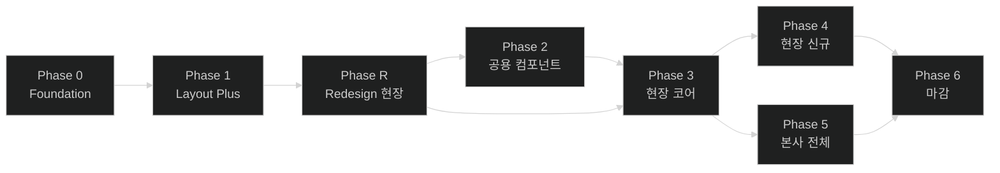

# 작업 로드맵 (roadmap.md)

> 본 문서는 [`screens.md`](./screens.md)의 화면 진행도(✓/△/✗)와 그동안 정리된 결정/Open Question을 종합한 **작업 순서**다.
>
> **원칙**
> - 화면보다 **인프라·공통**이 먼저 (Foundation 우선).
> - 위험도 A 화면은 안정된 공통 위에서 만든다.
> - 화면 작업은 현장(`/*`) → 본사(`/admin/*`) 순서 (1차 타겟 = 현장관리자).
>
> **항목 표기**
> - 위험도: A(치명적) / B(일반 CRUD) / C(정적)
> - 의존성: 이 항목을 시작하려면 끝나야 하는 선행 항목
> - 비고: 관련 문서/결정 링크

---

## 1. 우선순위 원칙

1. **인프라/공용**(Phase 0~2)이 화면 작업(Phase 3~5)에 선행한다.
2. **권한·인증 흐름**은 어떤 화면보다도 먼저 안정화한다.
3. **위험도 A 화면**(인증/권한/데이터 변형)은 토큰·가드·DTO가 확정된 뒤 시작한다.
4. 현장(`/*`)은 본사(`/admin/*`)보다 먼저. 명세서가 "여기에 가장 공들임"이라 명시.
5. **점진 마이그레이션 우선** (예: AppButton). 한 번에 전수 교체 금지(A3 최소 변경).

---

## 2. Phase 한눈에

| Phase | 테마 | 핵심 산출물 | 주 위험도 |
|---|---|---|---|
| **0** | Foundation | path 상수 / env / axios + `ApiResponse` 인터셉터 / 401 refresh / react-query / enum SSOT / `useQueryParams` / `<RequireRole>` / **sonner toast** / **MSW** / **AppFormField 분석·도입** | A |
| **1** | Layout Plus | AuthGuard 실제화 / 모바일 햄버거+Sheet / 본사 사이드바 config / TopNav 메뉴명 매핑 / ProfileBadge 메뉴 / 401·403·404 / AppTable 페이지네이션 / AppButton 마이그레이션 착수 | A·B |
| **R** | **Redesign (현장 사이트)** | **Pretendard + OKLCH 토큰 매핑 / `ServiceLayout` + 68px `RailSidebar` + 페이지 자연 스크롤 / 공용 컴포넌트(AppPageHeader · AppFilterButton · AppPagination · AppDetailCard · AppKpiCard · 결과 뱃지 5종) / 현장 5개 화면(순찰이력·코스/지점·근무자·배치관리·공지사항) UI 전면 교체** | **A·B** |
| **2** | 공용 컴포넌트 확충 | AppSelect / AppDatePicker / dnd-kit Provider / Notice 첨부 업로드 위젯 / 알림 시트 본문 | B |
| **3** | 현장 코어 △→✓ | `/login` / `/zones` 디테일 / `/points` 디테일 / `/patrol/zones` 디테일 / `/patrol/points` 신규 / Export | A·B |
| **4** | 현장 신규 영역 ✗→✓ | `/users` / `/notice` / `/settings/keywords` | B·C |
| **5** | 본사 영역 전체 | `/admin/login` / `/admin/locations`(+상세+헬스체크) / `/admin/admins`(+할당) | A |
| **6** | 마감 | 권한 매트릭스 검증 / 접근성 / 콘텐츠 톤 점검 / AppButton 마이그레이션 완료 / 성능 점검 / 정리 | — |

> **Phase R 삽입 사유**: 2026-07-23 리디자인 결정으로 현장 사이트 UI를 Notion/Linear/Vercel 계열로 전면 교체. 셸 자체가 바뀌므로 Phase 2/3의 화면 작업이 신규 셸 위에서 얹혀야 함. 데이터·기능·문구는 유지, UI만 교체. `/admin/*`(본사)은 이번 라운드 미적용 → Phase 5에서 별도 처리.

---

## 3. Phase 0 — Foundation (인프라)

화면이 의존하는 코어. 여기 늦으면 나중에 전수 수정 비용.

Phase 0은 spec 단위로 4개로 분할: **001-api-foundation** / **002-lint-cleanup** / **003-auth-foundation** / **004-dev-infrastructure**.
폴더는 Phase별로 묶는다: `specs/phase0/{001,002,003,004}-*/`. (번호는 Phase 무관 글로벌 일련번호)

| 항목 | 결과물 | 소속 spec | 의존성 | 비고 |
|---|---|---|---|---|
| axios 인스턴스 | `lib/axios.ts` | 001 | env | baseURL + 토큰 헤더 |
| **응답 인터셉터** | `ApiResponse<T>` unwrap + `code !== 200` throw | 001 | axios | `data-model.md` §2-1, §6 |
| react-query 셋업 | `QueryClientProvider` + 기본 옵션 + `select` 변환 규칙 | 001 | axios | DTO→ViewModel 변환은 select에서 |
| **sonner toast** | `<Toaster>` 마운트 + 기본 옵션 + 헬퍼(`toast.success`/`toast.error`) | 001 | — | `design-system.md` D6 |
| 사전 lint 정비 | 기존 lint 19건 해소 → `npm run verify` green | 002 | — | 001 이월. zone form / points·zones page / AuthGuard 등 본 spec 범위 밖이던 기존 에러 |
| **401 → refresh** | `/auth/refresh` 자동 호출 + 재시도 + 실패 시 영역별 로그인 이동 | 003 | 인터셉터 | `data-model.md` §4-3, `flow.md` §3-2 |
| 권한 가드 헬퍼 | `<RequireRole roles={[...]}>` | 003 | useMe 훅 | 화면 내 액션 권한 |
| `useMe()` 훅 | `MeDto` 상태 + 새로고침 시 `/auth/me` 동기화 | 003 | react-query | `data-model.md` §4-3 |
| 라우트 상수 SSOT | `src/router/paths.ts` | 004 | — | `screens.md` §4 라우트 매핑 |
| env 분기 | `VITE_API_BASE_URL` 등 | 004 | — | 테스트=IP / 운영=도메인+prefix (`data-model.md` §4) |
| Enum SSOT | `src/types/enum.ts` + 라벨 매핑 | 004 | — | `data-model.md` §2-2 |
| `useQueryParams` 헬퍼 | URL 쿼리스트링 표준 접근 | 004 | — | `patterns.md` §6 |
| **MSW 도입** | `src/mocks/handlers/*` + 개발용 worker 마운트 | 004 | react-query | 기존 `features/{도메인}/mock/*` 이관 |
| **vitest 셋업** | `vitest.config.ts` + `@testing-library/react` + `package.json` 스크립트(`test`, `test:watch`) | 004 | MSW | `workflow-protocol.md` WF-4 검증 인프라. 백엔드 연결 전엔 MSW 기반 단위/통합 테스트 |
| **AppFormField 분석·도입** | 폼 컨테이너 컴포넌트 + AppInput 폼 영역 정리 | 004 | — | `design-system.md` §6 Open Q 해소. Phase 3 폼 작업 전 필수 |
| Error Boundary (전역) | 페이지 단위 fallback | 004 | — | 안전망 |

**Phase 0 종료 조건(DoD)**
- 새 화면이 axios·react-query·toast·가드를 **표준 사용법대로** 호출할 수 있다.
- `npm run verify` 통과.
- `design-system.md` §6의 "AppFormField 도입 분석" Open Q 해소.

---

## 4. Phase 1 — Layout Plus (셸 확장)

화면 작업 가능한 최소 셸 완성.

| 항목 | 결과물 | 의존성 | 비고 |
|---|---|---|---|
| AuthGuard 실제화 | `isAuthentication = true` 제거 + 실 토큰 검사 + role 분기 | Phase 0 인증 셋업 | `flow.md` §0 |
| 모바일 햄버거 + Sidebar Sheet | TopNav 좌측 햄버거(`lg:hidden`) + 사이드바를 `ui/sheet`로 감쌈 | — | `layout.md` §5-6 |
| 본사 사이드바 config 분리 | `AdminMenus` export | — | `layout.md` §6 |
| TopNav 메뉴명 매핑 | 라우트 → 메뉴명 lookup | path 상수 | `layout.md` §6 |
| ProfileBadge 드롭다운 | 로그아웃 / 내 정보 | useMe | `layout.md` §6 |
| 401·403·404 화면 | 각 상태 페이지 컴포넌트 + 라우트 등록 | — | `screens.md` §3, `flow.md` §3-2 |
| AppTable 페이지네이션 UI | 페이지 번호·이전/다음·전체 표시 | Phase 0 page 1-based | `components.md` §9, `data-model.md` §2-1 |
| AppButton 마이그레이션 (착수) | 새 화면 = AppButton만. 기존 = 화면 작업 시 함께 교체 | — | `design-system.md` D1 |

**Phase 1 종료 조건**
- 모바일에서 사이드바 동작 확인.
- 새 화면이 페이지네이션 컴포넌트 그대로 사용 가능.
- 비인증 진입 시 라우트별 적절한 로그인 화면으로 리다이렉트 검증.

---

## 5. Phase R — Redesign (현장 사이트 UI 전면 교체)

> **배경**: 2026-07-23 결정. 1차 시안이 "장난감 같다"는 피드백 → Notion / Linear / Vercel 계열 미니멀·고밀도 SaaS 스타일로 전환. 데이터·기능·문구는 유지, UI만 교체.
> **범위**: 현장 사이트(`/*`) 전체 셸 + 5개 화면(순찰이력·코스/지점·근무자·배치관리·공지사항).
> **범위 밖**: `/admin/*` 본사 사이트, 로그인/랜딩 → Phase 5에서 별도 처리.
> **입력 문서**: [`docs/new-design-note.md`](./new-design-note.md), [`docs/ui-mock/현장/**/*-신규.png`](./ui-mock/), [`docs/design-system.md`](./design-system.md) D10, [`docs/layout.md`](./layout.md) §0·§2, [`docs/screens.md`](./screens.md) §1-2~§1-5.

### 5-1. 페이즈 구조 (R0 → R1 → R2 → R3)

| 단계 | 성격 | Spec | 병렬 가능? |
|---|---|---|:-:|
| **R0** | 기반 (블로킹) | 007 (단일 통합) | X (선행 필수) |
| **R1** | 공용 컴포넌트 | 008 (단일 통합) | R0 완료 후 시작 |
| **R2** | 화면별 리디자인 | 009 ~ 015 (7개 spec) | R1 완료 후, 화면 간 병렬 가능 |
| **R3** | 회귀 확인 | 016 | R2 전체 완료 후 |

### 5-2. Spec 인벤토리

| Spec ID | 폴더 | 성격 | 위험도 | 라우트 | 비고 |
|---|---|---|:-:|---|---|
| **007** | `specs/phaseR/007-redesign-foundation/` | R0. Pretendard 폰트 + OKLCH 토큰 매핑 + `--rail`/`--rail-2` 신설 + **라우터 레벨 `ServiceLayout`/`AdminLayout` 분리** + 68px `RailSidebar` 신규 + 페이지 자연 스크롤 정책 전환 | **A** | (셸) | 이후 모든 화면의 전제 조건 |
| **008** | `specs/phaseR/008-redesign-shared-components/` | R1. `AppPageHeader` / `AppFilterButton` / `AppPagination`(리뉴얼) / `AppDetailCard` / `AppKpiCard` / 결과 뱃지 5종 variant 추가 | B | (컴포넌트) | R2에서 재사용 |
| **009** | `specs/phaseR/009-patrol-history-zone/` | R2-1. 순찰이력 코스 탭 리디자인 | B | `/patrol/zones` | 마스터-디테일 카드화, 특이사항 자동펼침 |
| **010** | `specs/phaseR/010-patrol-history-point/` | R2-2. 순찰이력 지점 탭 (신설) + 기록 상세 모달 | B | `/patrol/points` | screens.md §1-2 진행도 ✗ → ✓ |
| **011** | `specs/phaseR/011-course-management/` | R2-3. 코스 탭 + 경로 다이어그램 카드 신규 | B | `/zones` | zigzag 다이어그램, 4개마다 줄바꿈, 좁은 폭 숨김 |
| **012** | `specs/phaseR/012-point-management/` | R2-4. 지점 탭 (편집 모달 유지) | B | `/points` | 상세 카드 확장 |
| **013** | `specs/phaseR/013-workers/` | R2-5. 근무자 관리 (신규 라우트) | B | `/users` | 배치변경 버튼 제거, 메뉴명 "근무자" |
| **014** | `specs/phaseR/014-deployments/` | R2-6. 배치관리 대시보드 (신규 라우트, 신규 워크플로) | **A** | `/deployments` | KPI + 인라인 승인/거부 + 거부 사유 모달 + 이력 탭 |
| **015** | `specs/phaseR/015-notice/` | R2-7. 공지사항 (다른 화면과 동일 컨셉 자동 적용) | B | `/notice` | 별도 목업 요청 없음 |
| **016** | `specs/phaseR/016-redesign-regression/` | R3. 본사 사이트 미영향 + 로그인/랜딩 미영향 + 접근성/콘텐츠 톤 회귀 | C | (전역) | 리디자인 마감 |

### 5-3. Phase R 종료 조건 (DoD)

- 현장 사이트 5개 화면이 모두 신규 셸(`ServiceLayout` + `RailSidebar`)에서 렌더링되고 `docs/ui-mock/현장/**/*-신규.png`와 시각적으로 일치.
- `/admin/*` 본사 사이트는 기존 셸(`AdminLayout` + `Sidebar` w-70 + `TopNav`)로 그대로 동작 (리디자인 미적용).
- 로그인/랜딩 페이지 미영향.
- `npm run verify` + `npm run test` green.
- `screens.md` §1-2~§1-5의 진행도 컬럼과 §4 라우트 매핑이 리디자인 완료 상태로 동기화.

### 5-4. Phase R 이후 (Phase 2~4)

- 원래 Phase 2 (공용 컴포넌트 확충)는 리디자인 이후에도 여전히 필요 (`AppSelect`/`AppDatePicker`/dnd-kit Provider 등은 리디자인 범위 밖).
- Phase 3/4의 화면 작업은 이제 **리디자인된 셸 위에서** 진행. 화면별 진행도 △/✗을 ✓로 마감하는 작업은 그대로 유효하되, 리디자인 결정에 맞춰 세부 스펙 재확인 필요.

---

## 6. Phase 2 — 공용 컴포넌트 확충

Phase 3 폼·이력 화면이 막히지 않도록 미리.

| 항목 | 결과물 | 의존성 | 비고 |
|---|---|---|---|
| AppSelect | 선택 컴포넌트 (라벨/에러/필수) | Phase 0 AppFormField | 사업장 셀렉트·필터에 광범위 사용 |
| AppDatePicker | 단일/범위 일자 선택 | AppFormField | 계약기간·이력 필터 |
| dnd-kit Provider | 정렬 가능한 리스트 추상 (`<SortableList>` 등) | — | `patterns.md` §5 |
| Notice 첨부 업로드 위젯 | 파일 선택·미리보기·삭제 | — | `data-model.md` `NoticeAttachment` |
| 알림 시트 본문 | 알림 목록 컴포넌트(읽음·시간) | — | `layout.md` §6 |

**Phase 2 종료 조건**
- 화면 작업 시 추가 공용 컴포넌트가 더 필요해 멈추는 일이 없다.

---

## 7. Phase 3 — 현장 코어 화면 마감 (△ → ✓)

screens.md 진행도 △ 일괄 마무리. 위험도 A 우선.

| 항목 | 라우트 | 위험도 | 상태 | 비고 |
|---|---|:-:|:-:|---|
| 로그인 실구현 | `/login` | A | ✗ | 사번 6자리 + 비번 8자리 검증. zod 스키마 |
| 코스 추가/수정/삭제 | `/zones` 모달 | A | △ | 폼 + 확인 모달 |
| 코스 내 지점 드래그 정렬 | `/zones` | A | △ | dnd-kit + `ReorderCoursePointsRequest` |
| 코스 내 지점 시간/활성 모달 | `/zones` 모달 | A | △ | `UpdateCoursePointRequest` |
| 지점 추가/수정 | `/points` 모달 | A | △ | NFC HEX 14자리 검증 (zod) |
| 지점 QR 다운로드 | `/points` 액션 | A | △ | 파일 다운로드 |
| 지점 삭제 | `/points` 액션 | A | ✗ | 사용 중 코스 영향 검사 (서버 책임 — Open Q) |
| 코스 이력 필터·상세 | `/patrol/zones` | B | △ | URL 쿼리스트링 / 타임라인 / `useQueryParams` |
| 지점 이력 + 기록 상세 | `/patrol/points` | B | ✗ | 신규. 모달 상세 포함 |
| 이력 Export | 액션 | B | ✗ | Excel / PDF. 두 이력 공용 |

**Phase 3 종료 조건**
- screens.md 1-2/1-3의 진행도가 모두 ✓.
- 실 API 또는 MSW로 동작 확인.

---

## 8. Phase 4 — 현장 신규 영역 (✗ → ✓)

| 항목 | 라우트 | 위험도 | 비고 |
|---|---|:-:|---|
| 근무자 목록 + 상세 | `/users` | B | 검색·필터 + 마스터-디테일 |
| 근무자 추가/수정 | 모달 | B | 현장관리자만 생성 |
| 배치관리(신규) | `/deployments` | A | 근무자 APP 요청 → 목적지 관리자 승인/거부. `ApproveDeploymentRequest` / `RejectDeploymentRequest` |
| 공지 목록 + 상세 | `/notice` | B | 마스터-디테일 + 첨부 표시 |
| 공지 작성/수정/삭제 | 모달 | B | "저장 시 앱 푸시" 체크박스 |
| 환경설정 — 키워드 | `/settings/keywords` | C | UX TBD. 후순위 가능 |

**Phase 4 종료 조건**
- screens.md 1-4/1-5의 진행도가 모두 ✓ (키워드는 UX 확정 후).

---

## 9. Phase 5 — 본사 영역 전체

전부 ✗에서 시작. 거의 다 위험도 A.

| 항목 | 라우트 | 위험도 | 비고 |
|---|---|:-:|---|
| 본사 로그인 | `/admin/login` | A | URL 직접 접근 |
| 관리자 목록 + 상세 | `/admin/admins` | B | 검색·필터·마스터-디테일 |
| 관리자 추가 | 모달 | A | 권한별 생성 제한(시스템→Master, Master→Manager) |
| 사업장 할당 모달 | 모달 | A | 다중 선택 |
| 관리그룹 트리 | `/admin/locations` 좌측 | A | Level 3, +/⋯ 컨텍스트 |
| 사업장 목록 | `/admin/locations` 우측 | A | 검색 + 운영상태 필터 |
| 사업장 추가/수정 | 모달 | A | 계약기간 포함 |
| **사업장 삭제** | 모달 | A | **패스워드 재확인** (`patterns.md` §4) |
| 사업장 상세 — 기본정보 | `/admin/locations/:id` | A | 담당 관리자 지정 섹션 |
| 사업장 상세 — 헬스체크 + 비상연락망 | `/admin/locations/:id?tab=health` | A | 요일별 담당자 다중 |

**Phase 5 종료 조건**
- screens.md §2 진행도가 모두 ✓.
- 권한별 데이터 스코프 동작 검증(Manager는 할당 사업장만 보임).

---

## 10. Phase 6 — 마감

| 항목 | 비고 |
|---|---|
| 권한 매트릭스 전수 검증 | `<RequireRole>` 누락 점검, 화면×역할 매트릭스 |
| 접근성 최종 검토 | 포커스 링·키보드 동선·색 대비 |
| 콘텐츠 톤 점검 | 확인 문구·빈 상태·에러 메시지 일관 (`design-system.md` §4) |
| **AppButton 마이그레이션 완료** | shadcn `ui/button.tsx` 제거 (`design-system.md` D1) |
| 성능 점검 | 테이블·트리 가상화 여부 / 큰 목록 페이지 |
| mock/주석 정리 | 사용 안 하는 mock 제거 |
| `screens.md` 진행도 일괄 ✓ 확인 | 진행도 컬럼 최종 동기화 |

---

## 11. 의존성 도식

- Phase R은 Phase 1 완료 후 시작. 현장 셸 자체가 바뀌므로 Phase 2/3의 화면 작업이 Phase R 이후에 얹혀야 함.
- Phase R 내부: R0(007) → R1(008) → R2(009~015, 화면 간 병렬 가능) → R3(016).
- Phase 5(본사)는 리디자인 미적용이라 Phase R과 무관하게 진행 가능. 다만 Phase R에서 라우터 분리(`ServiceLayout`/`AdminLayout`)가 이뤄지므로 Phase 5는 그 위에서 안전.
- Phase 4·5는 인력이 있다면 병렬 가능(공통 위에서 도메인이 갈리므로).

---

## 12. 진행 추적 매트릭스

각 Phase 끝나면 해당 줄에 ✓.

| Phase | DoD 통과 | 비고 |
|---|:-:|---|
| 0 Foundation — 001 api | ☐ | axios·react-query·sonner |
| 0 Foundation — 002 lint cleanup | ☑ | 사전 lint 19건 해소 (001 이월). T029 수동 회귀만 003에서 마무리 |
| 0 Foundation — 003 auth | ☑ | 401 single-flight refresh + 요청 인터셉터 토큰 부착 + `useMe`(MeRaw→MeDto select) + `<RequireRole>` UI 액션 가드 + 토큰/리다이렉트 헬퍼. AuthGuard 본체 연결과 002 T029 수동 회귀는 Phase 1로 이월 |
| 0 Foundation — 004 dev infra | ☑ | paths SSOT + `.env.example` + Enum SSOT + `useQueryParams` + MSW(auth 핸들러 + browser/server + opt-in `VITE_USE_MSW`) + vitest(jsdom + RTL + jest-dom) + AppFormField(D9) + AppErrorBoundary + 라우트 `errorElement`. AuthGuard 실제화는 Phase 1로 이월 |
| 1 Layout Plus — 005 auth/error | ☑ | AuthGuard 실제화(토큰·useMe 분기, 영역별 로그인) + `<RequireRoute>` 신설 + 403/404 페이지 + admin placeholder로 RequireRoute 실라우트 검증 + 401 별도 페이지 미생성 결정 + screens.md §6 Open Q 해소. vitest 13건 추가 |
| 1 Layout Plus — 006 shell/table | ☑ | 모바일 햄버거+Sheet, 본사 사이드바 `AdminMenus`, TopNav 메뉴명 lookup, ProfileBadge 드롭다운+로그아웃, AppTable 페이지네이션(1-based), AppButton 옵션1 마이그(`Button`→`app/AppButton`+11곳 import), 005 액션 AppButton 교체, MSW README 안내. layout.md/components.md/design-system.md Open Q 5건 해소. vitest 15건 추가(누적 28건) |
| 1 Layout Plus (전체) | ☑ | 005·006 모두 완료. roadmap §4 Phase 1 종료 조건 3건 충족 (모바일 사이드바·페이지네이션·로그인 리다이렉트) |
| R Redesign — 007 foundation | ☐ | Pretendard + OKLCH 매핑 + `ServiceLayout`/`AdminLayout` 분리 + `RailSidebar` 68px + 페이지 자연 스크롤 |
| R Redesign — 008 shared components | ☐ | AppPageHeader / AppFilterButton / AppPagination / AppDetailCard / AppKpiCard / 결과 뱃지 5종 |
| R Redesign — 009 patrol-history-zone | ☐ | `/patrol/zones` 리디자인 |
| R Redesign — 010 patrol-history-point | ☐ | `/patrol/points` 신설 + 기록 상세 모달 |
| R Redesign — 011 course-management | ☐ | `/zones` + 경로 다이어그램 카드 |
| R Redesign — 012 point-management | ☐ | `/points` (편집 모달 유지) |
| R Redesign — 013 workers | ☐ | `/users` 신규 라우트, 배치변경 버튼 제거 |
| R Redesign — 014 deployments | ☐ | `/deployments` 신규 라우트. KPI + 인라인 승인/거부 + 거부 사유 모달 |
| R Redesign — 015 notice | ☐ | `/notice` (다른 화면 컨셉 자동 적용) |
| R Redesign — 016 regression | ☐ | 본사 사이트 미영향 + 로그인/랜딩 미영향 회귀 |
| R Redesign (전체) | ☐ | 현장 5개 화면이 신규 셸에서 렌더링, screens.md §1-2~§1-5 동기화 |
| 2 공용 컴포넌트 | ☐ | |
| 3 현장 코어 | ☐ | screens.md §1-2/1-3 ✓ (Phase R 완료 후 재확인 필요) |
| 4 현장 신규 | ☐ | screens.md §1-4/1-5 ✓ (Phase R에서 이미 대부분 처리됨 → 재산정) |
| 5 본사 영역 | ☐ | screens.md §2 ✓ |
| 6 마감 | ☐ | — |

- 화면 단위 추적은 [`screens.md`](./screens.md) 진행도 컬럼과 연동한다.
- Phase 종료 시 본 매트릭스 + screens.md 둘 다 동기화.

---

## 13. Open Questions

- [ ] Phase별 **인력·일정** 산정(현재는 순서만)
- [ ] **본사·현장 동시 진행** 시 인력 분배 정책
- [ ] **MSW → 실 API 전환** 트리거 시점(전 Phase 종료 후? Phase 단위?)
- [ ] `/settings/keywords` UX 확정 시점 (Phase 4 안에 들어갈지, 별도 Phase로 미룰지)
- [ ] **본사 사이트의 모바일 대응 수준** — 본사는 사실상 PC 전용일 가능성. 모바일 분기를 Phase 1에 포함할지 결정
- [ ] **성능 임계치** — 테이블 가상화 도입 기준(예: N행 이상)
- [ ] **Phase R 이후 Phase 3/4 재산정** — 리디자인이 화면을 이미 만들면 Phase 3(현장 코어 △→✓)와 Phase 4(현장 신규 ✗→✓)의 범위가 대부분 흡수됨. Phase 3/4를 남길지, 흡수해서 Phase R로 통합할지 결정 필요.
- [ ] **본사 사이트 리디자인 라운드 시점** — 이번 Phase R 미포함. Phase 5 전에 별도 리디자인 라운드로 넣을지, Phase 5 안에 흡수할지.
- [ ] **spec 템플릿 §번호 참조** — `specs/_templates/spec.md`의 "roadmap.md §11 미완 ☐ spec" 참조가 §12로 밀림. 신규 spec 진입 전에 템플릿도 §12로 갱신 필요.
